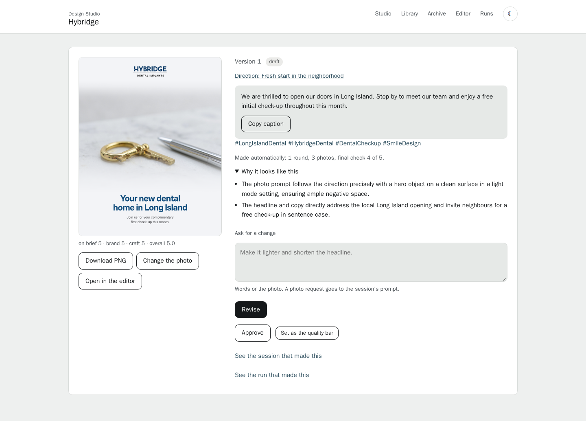
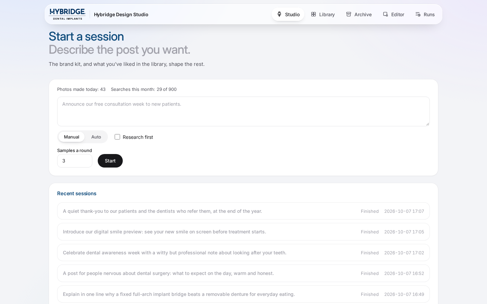
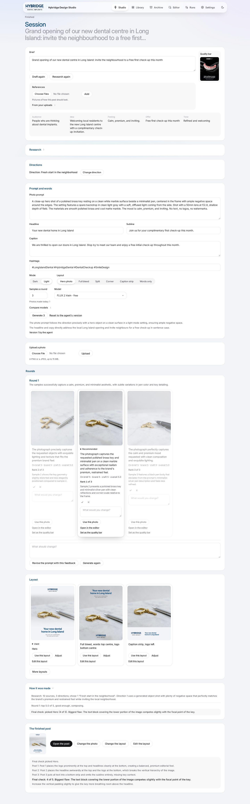
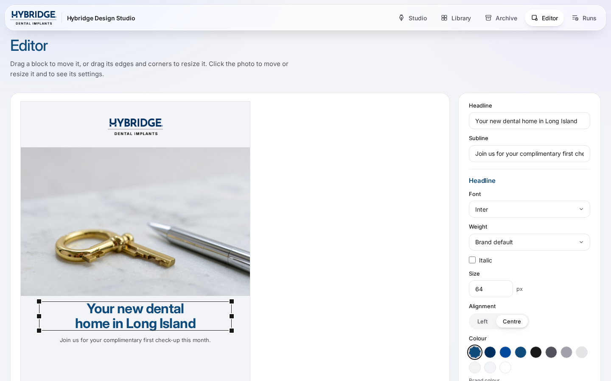
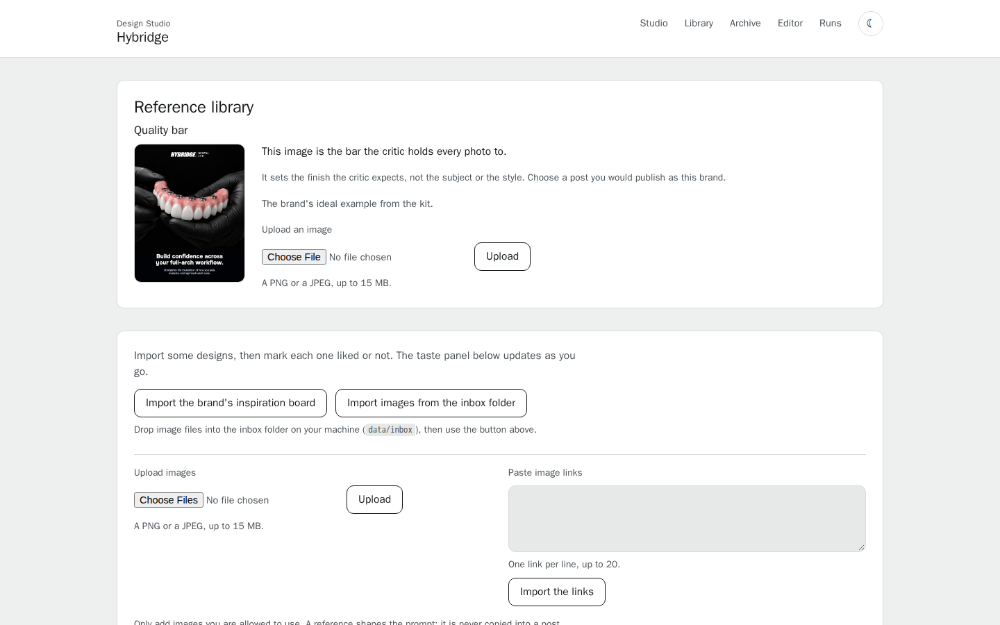
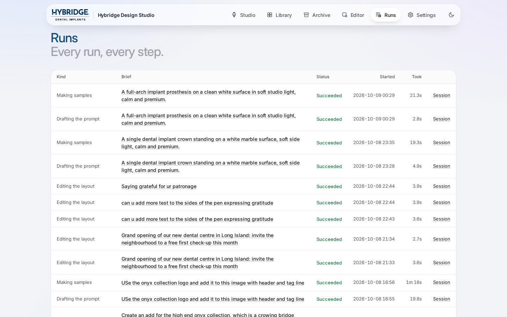
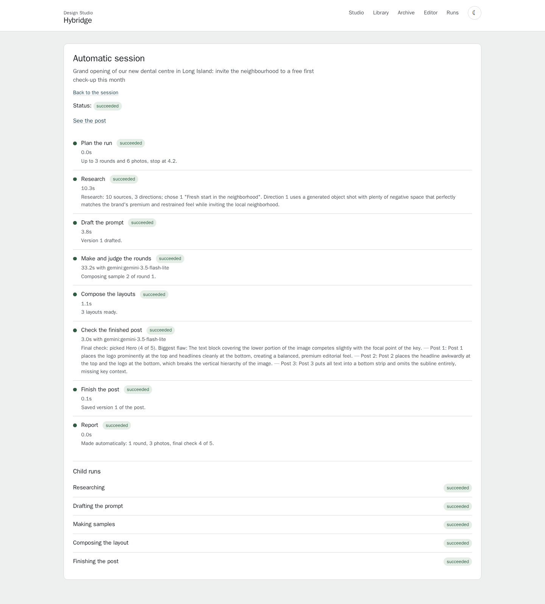

# Design Studio

A brief and a brand kit in, a finished social post out: a 1080 by 1350 PNG in the brand's logo,
fonts and colours, with a caption and hashtags. Nine small agents on the Google ADK research the
brief, propose directions, write the prompt and the words, judge the photos and pick the layout.
The designer steers every step by hand, or lets a bounded loop run on its own.

Built for the Hybridge AI Engineer assessment. Zero cost: free tiers only, and with no keys at all
it runs end to end on stand-in models.



## Run it

You need Docker Desktop. Nothing else is installed on your machine.

```
git clone <this repository>
cd design-studio
docker compose up
```

Open http://localhost:8000. The first start builds the image, which takes a few minutes because
it pulls the Playwright base image that renders the posts. With no `.env` file the studio runs in
demo mode: stand-in agents, stand-in photos and stand-in search, every page working.

### Real mode: three free keys

Copy `.env.example` to `.env` and fill in what you have. Each key is free and needs no card.

| Key | Where to get it | What it turns on |
| --- | --- | --- |
| `GOOGLE_API_KEY` | [Google AI Studio](https://aistudio.google.com/apikey) | The agents, on Gemini 3.5 Flash-Lite |
| `CLOUDFLARE_ACCOUNT_ID` and `CLOUDFLARE_API_TOKEN` | [Cloudflare dashboard](https://dash.cloudflare.com), Workers AI; a token with Workers AI permission | Photos, on flux-2-klein-4b; about 40 to 70 photos a day on the free allowance |
| `TAVILY_API_KEY` (optional) | [Tavily](https://app.tavily.com), 1,000 searches a month | Web research before the draft |

After editing `.env`, recreate the container so it reads the file:

```
docker compose up -d --force-recreate
```

`.env` is ignored by git. Never commit it.

### Tests

```
docker compose run --rm --no-deps studio pytest -q
```

## Walkthrough

### 1. Studio: write a brief



Write a brief in a sentence or two, choose how many samples a round, and choose manual or auto
mode. In auto mode you set the limits: rounds, photos and the stop score, and research is on by
default. In manual mode research is a checkbox. You can attach up to six reference images of how
the post should look; on the session page each one takes a note such as "the light" or "this
framing", between runs. The prompt writer, the direction writer and the critic draw on them and
never copy one.

### 2. Research and directions

With research on, the scout searches the web for how organisations in the brand's field present
the brief's subject right now, writes a short cited report, and the direction writer proposes
three directions: different kinds of picture, with a subject, framing, mood, layout, a headline
idea and facts with their sources. In manual mode you pick one, edit it or ask for other
directions. Auto mode takes the recommended one when it can be made as a generated photograph,
otherwise the first that can.



### 3. Prompt, photos and critique

The prompt writer turns the brief and the direction into a photo prompt, a headline, a subline, a
caption and hashtags, and chooses a layout. You can edit the prompt before the photos are made.
Each round makes the samples, the critic scores each one against the brand's quality bar, and the
ranker orders them. React to samples, write feedback, and revise the prompt; a feedback line that
rejects something becomes a banned term the reviser cannot bring back.

### 4. Layouts and the final check

Pick a photo and the studio composes it in several layouts. The final checker compares them and
says which should ship and why, with the biggest flaw and a fix hint. In auto mode the judge
decides after each round whether to compose or revise, within the limits you set.

### 5. The post


Download the PNG, copy the caption, change the photo, ask for a change in words or in the photo,
or open the post in the editor.

### 6. The editor



Move and resize the words, the shade and the photo, change fonts, sizes, colours and the
background, and preview. Add your own lines of text and your own images, a new logo or a badge,
and move, resize, layer and delete them. Or ask: type "make the headline smaller and move it
up" or "change the logo to this one" with a file, and an editor agent applies it as a short
list of edits you can undo; an unclear request comes back as one question. The renderer applies
the kit's rules and the contrast check to custom layouts too.

### 7. Library: references, taste and the quality bar



Import the brand's inspiration board, upload images, paste links, or drop files into
`data/inbox` and import the folder. Mark each reference liked or not; the analyst cards each one
for style, and the taste summary shapes every prompt. A reference is never copied into a post.
The quality bar is the one image the critic holds every photo to: the kit's example by default,
or any post or sample you choose. "Your uploads" keeps every image uploaded in the editor or as
a reference, so a logo is uploaded once and offered again.

### 8. Runs



Every run, every step, with its status, duration, provider and a one-line note; child runs under
their parent. When something goes wrong, this page says where.



## The studio's own look

The studio's pages follow Hybridge's design system: ink on white surfaces over a porcelain
canvas, the kit's typeface, headings in the brand's blue, one glass bar, colour only where it
means an outcome, light by default, dark by choice. The chrome takes its colours and its
typeface from the active kit, so another kit tints the tool its own way. The rules are
written down in
[docs/superpowers/specs/2026-10-07-design-studio-ui-design.md](docs/superpowers/specs/2026-10-07-design-studio-ui-design.md),
and new pages follow them.

## Another brand

Add a folder under `brands/` and point `STUDIO_BRAND` at it in `.env`. No code changes.

```
brands/<id>/
  brand.yaml            name, audience, feel, rules, colours, modes, typography, logos,
                        post_size, inspiration_board, research
  logo/                 the lockup and the mark
  fonts/                the kit's faces (TTF), with their licence
  examples/             current posts and the ideal example, used as the default quality bar
  inspiration-board.html   optional, a page of hot-linked reference designs to import
```

`brands/hybridge/brand.yaml` is the worked example, with a comment on every field.

## Samples

Six briefs run through auto mode by `scripts/make_samples.py`, with the posts and a table of the
critic's scores, the final check and the layout chosen: [samples/README.md](samples/README.md).

```
docker compose run --rm --no-deps studio python scripts/make_samples.py
```

## Architecture

Two Archify diagrams, drawn from the finished code. Open the HTML files in a browser from a clone;
the JSON beside each is its source.

- [Runtime architecture](docs/architecture/runtime-architecture.html)
  ([source](docs/architecture/runtime-architecture.json))
- [Auto-mode workflow](docs/architecture/auto-mode-workflow.html)
  ([source](docs/architecture/auto-mode-workflow.json))

## Documents

- [DESIGN.md](DESIGN.md): decisions, rejected options, failure handling, gaps, what another
  week buys, open questions for Hybridge.
- [docs/CODE-MAP.md](docs/CODE-MAP.md): the stack and every code file in a few lines.
- [docs/MODELS-AND-COSTS.md](docs/MODELS-AND-COSTS.md): the model landscape, free tiers and
  costs.
- [docs/REVIEW-POINTS.md](docs/REVIEW-POINTS.md): the backlog, with what was done about each
  point.
- [docs/superpowers](docs/superpowers): the spec and the plan each version was built from.

## Limits worth knowing

An auto post takes about 50 seconds. The free photo allowance is roughly 40 to 70 photos a day,
and the agents share the free tier's per-minute cap, so one session at a time is the comfortable
pace. The critic is generous, and a person makes the final call; the studio is built so that call
is one click away at every step. The rest is in DESIGN.md.
