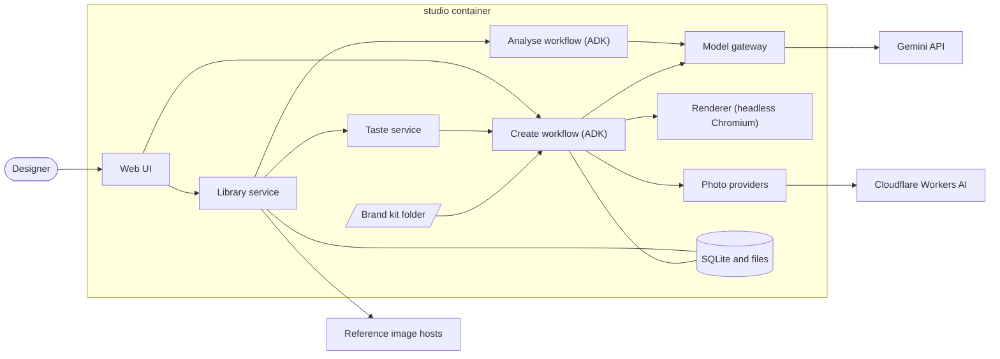
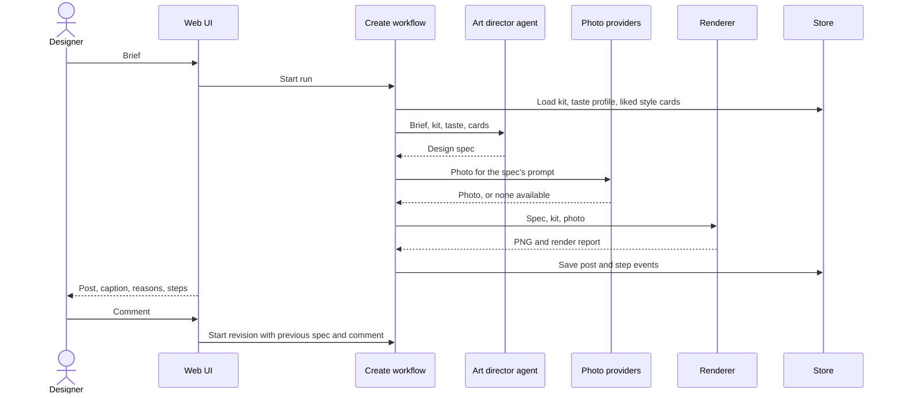

# Design Studio v1: design

Date: 2026-10-05. Status: draft for review. "Design Studio" is a working title; the repo name is not chosen.

Requirements come from the Hybridge AI Engineer assessment PDF and the brand kit's README. This document covers version 1 (v1) only.

## 1. What v1 is

v1 is the thinnest version of the whole product that works from start to finish on one machine, started by one command. A designer can:

1. import a library of reference designs,
2. mark each one liked or not,
3. type a short brief,
4. get a finished post (a 1080×1350 image and a caption) built from the brand kit and shaped by those likes,
5. comment on the post to get a revised version, and
6. see the steps each run took.

v1 proves the loop works. It ends at a checkpoint: review the posts and the loop, then choose what to deepen. Depth comes in v2, and hardening and hand-in material in v3 (section 13).

### v1 is done when

| # | Check |
|---|---|
| 1 | `docker compose up` starts the studio at `http://localhost:8000`. With no keys it runs in demo mode on fake models; with keys it uses real ones. |
| 2 | Importing the Hybridge inspiration board adds its 60 references, each with a cached image and a style card. |
| 3 | Likes and dislikes survive a restart and change the taste profile shown on screen. |
| 4 | A brief produces a 1080×1350 PNG that uses the kit's logo file, Inter and palette, plus a caption. |
| 5 | A comment on a post produces a new version, and both versions are kept. |
| 6 | The run page lists each step with its status, duration, model or provider, and the reasons the agent gave. |
| 7 | With the photo provider switched off, the run still finishes with a type-only post and says why. |
| 8 | Pointing the studio at a second brand folder (a test fixture) changes logo, colours and type with no code change. |
| 9 | The tests pass inside the container with no network access. |

### Terms

| Term | Meaning |
|---|---|
| Brand kit | A folder holding one brand's logo, fonts, colours and rules, described by a `brand.yaml` file |
| Reference | A design collected for its style. It is never copied into a post |
| Style card | A structured description of one reference, written once by a vision model |
| Taste profile | A summary of what the liked and the disliked references have in common |
| Design spec | The JSON description of one post: layout, words, photo request, caption and reasons |
| Run | One execution of a workflow, made of steps |

## 2. The designer's path

| Page | What the designer does | What happens |
|---|---|---|
| Library | Imports the kit's inspiration board or a folder of images, then ticks or crosses each reference | Images are cached, style cards are written in the background, and the taste profile updates |
| Studio | Types a brief and presses Generate | A run starts and the page follows its steps |
| Post | Reads the image, caption and reasons; comments, approves or downloads | A comment starts a revision run; approval marks the version final |
| Run | Opens any run | Every step is listed with status, timing, provider, reasons and errors |

## 3. Architecture

Everything runs in one container, `studio`. Outside it are two model services and the hosts the reference images come from.



| Component | Its one job | Depends on |
|---|---|---|
| Brand kit loader | Read and validate a brand folder into a `BrandKit` | Files only |
| Library service | Import references, cache their images, record likes and dislikes | Reference sources, store |
| Analyse workflow | Write one style card per reference | Model gateway |
| Taste service | Turn likes, dislikes and style cards into a taste profile | Store |
| Create workflow | Turn a brief into a finished post | Kit, taste, model gateway, photo providers, renderer |
| Model gateway | Make every language-model call: pacing, retry, demo mode | Gemini API |
| Photo providers | Return one photo for a prompt, or say none is available | Cloudflare Workers AI |
| Renderer | Turn a design spec, kit and photo into a PNG and a render report | Headless Chromium |
| Store | Keep references, runs, step events and posts | SQLite, a files folder |
| Web UI | The four pages in section 2 | All of the above |

Each of the three outside-facing parts (model gateway, photo providers, reference sources) is an interface with a real implementation and a fake one. The fakes make demo mode and the offline tests possible.

## 4. Workflows on ADK

The agent layer uses Google's Agent Development Kit (ADK) 2.x. Step order is fixed by an ADK `Workflow` graph. Each step is a node, and a node is either an `LlmAgent` or a plain function. Steps pass data through session state, and each step emits events that the studio saves as the run's step list.

**Code decides what happens next; agents decide content.** No agent chooses the next step in v1. This keeps runs predictable, cheap on free tiers and easy to debug.

### The two agents

| Agent | Owns | Reads | Writes |
|---|---|---|---|
| Analyst | Describing one reference | The reference image | A style card |
| Art director | Deciding one post | The brief, the kit's feel and rules, the taste profile, the liked style cards | A design spec |

### Analyse workflow

`analyst` → `save_card`. The library service runs it once per reference, at a paced rate, and skips images it has already analysed (matched by content hash).

### Create workflow

`load_context` → `art_director` → `get_photo` → `render` → `save_post`

| Step | Kind | What it does |
|---|---|---|
| `load_context` | Function | Loads the kit, the taste profile and up to 12 liked style cards into state |
| `art_director` | Agent | Writes the design spec, including which references it drew on and why |
| `get_photo` | Function | Asks the photo provider for the spec's photo. If none is available, switches the spec to the type-only layout and records why |
| `render` | Function | Renders the PNG and the render report |
| `save_post` | Function | Saves the post as a new version and closes the run |

A revision is the same workflow started with the previous spec and the designer's comment in state. The art director changes only what the comment asks for, and the photo is reused unless the comment asks for a new one.



### ADK details that shape the build

- An `LlmAgent` inside a workflow runs as a single turn and does not see earlier conversation. Each agent therefore gets everything it needs through its instruction, built from state by a function.
- Agents return typed JSON through `output_schema` and `output_key`.
- Durable records live in the studio's own tables. ADK sessions are kept in memory and last one run.

## 5. Data contracts

Each is a Pydantic model, saved as JSON with the run that produced it.

| Contract | Written by | Main fields |
|---|---|---|
| `BrandKit` | Kit loader, from `brand.yaml` | Name, audience, feel, colours (name, hex, use), type (font files, headline weight, case rule), logos (lockup, mark, dark-background treatment), rules, post size |
| `Reference` | Library service | Source, source URL, label, cached image, content hash, status, choice (liked, disliked, none) |
| `StyleCard` | Analyst | Background (dark, light, colour), layout, amount of text, subject, colour count, three mood words, one sentence on technique |
| `TasteProfile` | Taste service | Counts of each style-card value among liked and among disliked references, a plain-language summary, liked reference ids |
| `DesignSpec` | Art director | Layout (`hero` or `type_only`), mode (dark or light), headline, subline, photo prompt, caption, hashtags, reference ids used, assumptions, reasons |
| `RenderReport` | Renderer | Output file, size, whether the text fit, adjustments made |
| `Post` | Create workflow | Run, version, image, caption, spec, render report, status (draft or approved) |
| `RunEvent` | Create and analyse workflows | Run, step, status, start and end time, model or provider, attempts, note, error |

Style-card fields use fixed vocabularies so they can be counted.

## 6. The two feedback loops

**Taste (persistent).** A tick or cross is saved against the reference. The taste service counts style-card values among liked and disliked references and writes a summary in code, for example "Liked 14: 11 dark background, 12 single centred subject, 13 under ten words." Every later post gets that summary and the liked cards, so the designer teaches taste once.

**Revision (per post).** A comment on a post starts a revision run and produces a new version. v1 does not carry these comments over to later posts.

The taste summary is built by code, not a model, so it is free, repeatable and testable. In demo mode the fake art director follows the taste profile's majority, which lets a test prove that changing likes changes the post.

## 7. Models and services

Checked on 2026-10-05. Model ids live in configuration, not code.

| Job | v1 choice | Free account needed |
|---|---|---|
| Text and vision | Gemini `gemini-3.5-flash-lite` | Google AI Studio API key |
| Photo generation | Cloudflare Workers AI `@cf/black-forest-labs/flux-2-klein-4b` | Cloudflare account id and API token |
| No keys set | Fake model and fake photo provider | None |

- **Why two services:** Gemini's free tier has no image generation, so the photo comes from elsewhere.
- **Calls per post:** one model call and one photo call to create; one model call, and sometimes a photo call, to revise.
- **Library import:** one vision call per reference, so 60 for the Hybridge board. At the default pace of 10 a minute this takes about 6 minutes, once.
- **Limits:** Google no longer publishes its free limits. Reports put Flash-Lite at about 15 requests a minute and 500 a day. The gateway paces calls, reads rate-limit responses and waits before retrying.
- **Photo allowance:** Cloudflare's free allocation is 10,000 neurons a day, an estimated 40 to 70 photos at this size.
- **Secrets:** keys come from a git-ignored `.env` file passed in by Compose. A committed `.env.example` lists them.

## 8. Rendering

- Layouts are HTML and CSS templates. The kit's colours, font files and logo paths are injected as CSS variables, so a layout never names a brand.
- v1 has two layouts, each in dark and light mode. `hero` puts a photo above the headline and subline, the shape of Hybridge's ideal example. `type_only` has no photo.
- Headless Chromium captures the page at the kit's post size, 1080×1350 by default. Photos are cropped to fit, so a provider may return any size.
- The logo file is placed as it is and never stretched. On dark backgrounds a white version is made from the lockup's transparency when the kit allows it, as Hybridge's README does.
- Text sits on solid colour, never directly on the photo, so contrast is known in advance.
- The page measures its own text boxes. If text overflows, the renderer steps the size down to the kit's minimum and records the change in the render report.

## 9. When things fail

| What fails | What the studio does | What the designer sees |
|---|---|---|
| Model rate limit or server error | Waits as the response asks and retries twice | The step shows the retries, then succeeds or fails |
| Model returns JSON that does not fit the contract | Retries once with the validation error included | On a second failure, the step fails with the error and a "Run again" button |
| Photo provider fails or is out of allowance | Switches to the type-only layout | A note on the post: no photo was available |
| Text does not fit at the minimum size | Finishes the post and flags it | A warning asking for shorter copy |
| A reference image cannot be fetched | Marks it unavailable and continues the import | A count of skipped references with reasons |
| The container restarts during a run | Marks the run interrupted at start-up | "Interrupted. Run again" |
| No keys are set | Runs in demo mode on fakes | A banner saying demo mode is on |

## 10. Storage and layout

SQLite holds references, runs, run events and posts. Images live beside it. Both sit in a `data/` folder mounted into the container, so they survive restarts and stay out of git.

```
design-studio/
  docker-compose.yml
  Dockerfile
  .env.example
  brands/
    hybridge/          brand.yaml, logo/, fonts/, examples/, inspiration-board.html
  studio/
    main.py            FastAPI app and routes
    contracts.py       the Pydantic models in section 5
    brand.py           brand kit loader
    library/           reference sources, import, taste service
    workflows/         ADK workflows and the two agents
    models.py          model gateway
    photos/            photo providers
    render/            layouts and renderer
    store.py           SQLite and files
    web/               page templates and static files
  tests/               includes a second brand as a fixture
  data/                git-ignored: database, cached references, photos, posts
  docs/
```

The stack is Python 3.12, `google-adk` 2.x, FastAPI with server-rendered pages, SQLite, and Playwright's Chromium for rendering. The host needs only Docker.

Reference images belong to their owners. They are cached in `data/` for analysis and are never committed or published.

## 11. Testing

All tests run in the container with no network: `docker compose run --rm studio pytest`.

| Area | What is tested |
|---|---|
| Brand kit loader | A valid kit loads; a missing logo or colour gives a clear error |
| Contracts | Sample model outputs validate; malformed ones fail with a readable message |
| Renderer | A fixed spec gives a 1080×1350 PNG; the logo keeps its proportions; a long headline triggers the size step-down; `type_only` works with no photo |
| Create workflow on fakes | A brief becomes a post end to end; a photo failure gives a type-only post; bad model JSON is retried once and then fails cleanly |
| Taste | Likes and dislikes give the expected profile; flipping them flips the fake art director's mode |
| Second brand | The fixture brand renders with its own logo, colours and font |

## 12. Decisions and rejected options

| Decision | Why | Rejected |
|---|---|---|
| Agents write a spec and code renders it | The logo, type and colours are exact every time, and the output is testable | An image model drawing the whole post: it cannot guarantee the logo or type. Fixed templates with fill-in text: little for agents to decide |
| A fixed workflow graph orders the steps | Predictable, easy to debug, few model calls | A coordinating agent that chooses the next step: more calls and harder to trace |
| ADK 2.x `Workflow` | `SequentialAgent` and its siblings are marked deprecated in 2.x | Pinning ADK 1.x, kept as the fallback |
| Hosted free tiers | Runs on any reviewer's machine without a graphics card | Local models, which can be added later behind the same interfaces |
| No photo means a type-only post | A run always ends with something publishable | Failing the run |
| Taste summary built in code from style cards | Transparent, free and testable | Embedding similarity, reconsidered if the library grows |
| SQLite and files in one container | Nothing to set up; one command | A database server or a vector database, not needed at this size |
| Server-rendered pages | Small and quick to build | A separate front-end app |
| The kit's inspiration board is the first source | Hybridge already curated it, and all 60 image links loaded on 2026-10-05 | Collecting from ad sites in v1, since their terms need checking first |

## 13. Not in v1

**v2, depth:** a critic agent with an automatic fix loop; three options per brief; the art director split into strategist, art director and copywriter; a clarifying question when a brief is too vague; a second model and a stock photo source as fallbacks; live reference sources with their terms checked; a run that compares photo models side by side; swipe on a phone; learning from post comments.

**v3, hardening and hand-in:** a second sample brand; a claims check for healthcare copy; remakes of Hybridge's current posts; README with screenshots; DESIGN.md; committed sample output; Archify diagrams drawn from the finished code; a secret scan; the demo video.

## 14. How v1 answers what they grade

| Area | v1's answer |
|---|---|
| Agent design | Two agents with one job each: the analyst describes a reference, the art director decides a post |
| Orchestration | An ADK workflow graph fixes the order; agents never pick the next step |
| Failure and fallbacks | Retry, then degrade to a type-only post; every failure appears on the run page |
| Calls to models and services | One model gateway and one photo interface, each with a fake |
| Visibility and debugging | Every step is saved with status, timing, provider and error |
| Explaining decisions | The design spec carries its reasons and the references used |
| Output | Logo, type and colours are exact by construction; scoring quality is v2 |
| The whole problem | Section 12 |
| Packaging | One Compose command; a brand is a folder |
| Engineering | Small modules behind interfaces; tests run offline |

## 15. Risks and open questions

| # | Risk or question | Plan |
|---|---|---|
| 1 | ADK 2.x's `Workflow` became generally available in May 2026 and is new to this build | The first build task is a small proof: one agent and one function step in a workflow. If it fights us, pin ADK 1.x; only `workflows/` changes |
| 2 | A free photo model may not reach Hybridge's bar, especially for teeth and faces | The second build task is ten test prompts through the photo provider, judged before more layout work |
| 3 | Gemini's free limits are unpublished and have been shrinking | Pacing, retries, caching of style cards, and a second model in v2 |
| 4 | Audience: the PDF says patients, the examples target clinicians | v1 does not depend on it, because audience lives in `brand.yaml` and the brief. Still worth one email to Sampreeth |
| 5 | Repo name, and the commit identity and attribution for a repo Hybridge will read | Sahaj decides before the first commit |

### What was verified on 2026-10-05, and how

| Fact | How it was checked |
|---|---|
| `google-adk` 2.11.0 is current and needs Python 3.10 or newer | PyPI, directly |
| `SequentialAgent` is deprecated in favour of `Workflow` | ADK source at tag v2.11.0, directly |
| An agent inside a workflow runs as a single turn; `output_schema` with `output_key` stores parsed JSON in state | ADK docs and source, by a research pass |
| Gemini's free tier includes Flash-Lite with image input and JSON output, and no image generation | Google's pricing and model pages, by a research pass |
| Cloudflare's free allocation and the photo model's existence | Cloudflare's pricing and model pages, by a research pass |
| All 60 inspiration-board image links return an image | Fetched each one, directly |
| Gemini's free request limits, and photos per day on Cloudflare | Not confirmed: third-party reports and an estimate |
