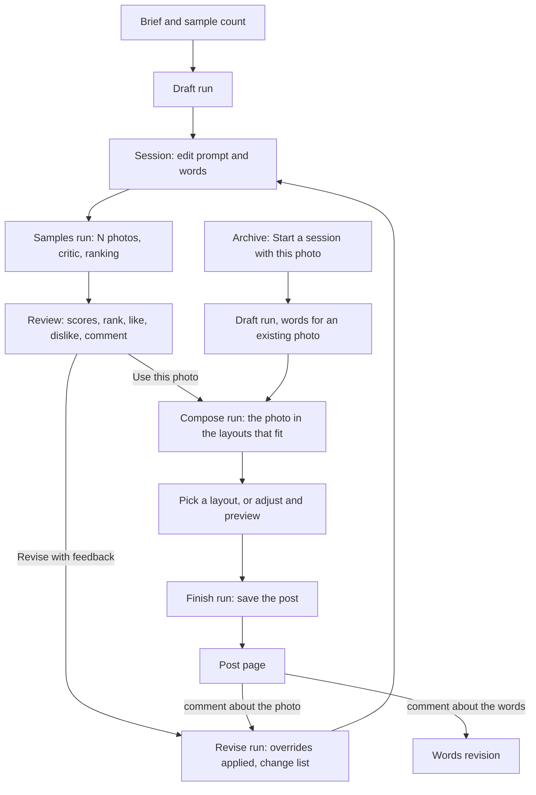

# Design Studio v2.1: design

Date: 2026-10-05. Status: draft for review. Builds on the v2 spec (`2026-10-05-design-studio-v2-design.md`); everything v2.1 does not mention stays as it is.

## 1. What v2.1 is

v2 gave the designer the image loop: an editable prompt, samples, a critic, feedback. Testing it showed the next gaps. The finished post has one shape; feedback that names a material can lose to the prompt's own words; a photo request typed on the post page goes nowhere useful; the critic praises everything; and good photos cannot be reused.

v2.1 makes seven changes:

| # | Change | In one line |
|---|---|---|
| 1 | Layout system and a Compose step | Six templates with parameters; the critic reports where the subject sits; the studio shows the chosen photo in the layouts that fit; the designer picks |
| 2 | Feedback overrides and a prompt diff | A material, colour, subject or setting named in feedback wins over the prompt; the page shows what changed between versions |
| 3 | One comment box on the post page | A comment about the photo goes to the session's prompt; a comment about the words revises the words; both does both |
| 4 | A stricter critic | Scores anchored against the brand's ideal example, realism judged, and the samples of a round ranked against each other |
| 5 | Comments on liked samples | "Keep this, but change what I said" |
| 6 | Reuse from the archive | Start a new session from any photo already made |
| 7 | Smaller fixes | Prompts trimmed to 120 words, per-sample progress while a round runs, cancel a run |

### Assumptions to confirm

1. The Compose step shows up to three fitting layouts first and offers the rest behind "More layouts"; the designer can also adjust logo position, text position and alignment by hand and preview again.
2. Templates are brand-neutral and all allowed by default; a kit may list which ones it allows in `brand.yaml`.
3. The critic's ranking call sees every sample of the round in one request (at most 6 images), which is one more Gemini call per round.
4. Starting a session from an archived photo skips the sample rounds: the photo is the pick, the agent writes the words for it, and the designer goes straight to Compose. Samples can still be generated in that session if wanted.
5. Cancelling a round keeps the samples that already finished as a partial round.
6. The post page keeps "Change the photo" and "Revise"; the single comment box replaces the old words-only box.

### v2.1 is done when

| # | Check |
|---|---|
| 1 | After "Use this photo" the session shows that photo in at least two layouts; picking one makes the post; the post's layout matches the thumbnail. |
| 2 | A photo with empty space on the left gets a layout whose words sit on the left; a photo with no calm area gets Hero or Split, never words over a busy photo. |
| 3 | Words placed over a photo are readable: the contrast check adds a shade only when the photo behind the text is too close to the text colour, and the render report says so. |
| 4 | Feedback "no silver, natural enamel" on a prompt that says "polished chrome" gives a new prompt without "chrome" and with "enamel", and the page lists the change; if the model keeps the banned word, the page flags it. |
| 5 | The session page shows the word-level difference between the current prompt version and the one before it. |
| 6 | A post-page comment "the teeth need to look real" starts a prompt revision in the session and the browser lands on the session page with a note; "make the headline shorter" revises the words as before. |
| 7 | A round's samples carry a rank and a one-line reason; the recommended pick is the top-ranked sample without a hard flag; the critic names the single biggest weakness of each sample. |
| 8 | A liked sample with a comment produces a revised prompt whose change list keeps the sample's subject and applies the comment. |
| 9 | The Archive offers "Start a session with this photo"; the new session opens with the photo as its pick and a brief box; after the draft, Compose is available at once. |
| 10 | Prompts longer than 120 words are trimmed at a sentence boundary; a running round shows "2 of 3 made"; "Stop" ends a run within a few seconds and the session is usable again. |
| 11 | All of it runs in demo mode on the stand-ins; the existing suite passes. |

## 2. The designer's path, updated



## 3. The layout system

### Templates

Every template is a Jinja template sharing one base (fonts, tokens, the fit script, the logo rules) and is driven only by the kit's tokens. Parameters are CSS classes and custom properties, never new markup.

| Template | Shape | Slots the photo must leave calm |
|---|---|---|
| `hero` (today) | Logo top centre; photo melts into the background between logo and words; words on solid colour below | None (the words never sit on the photo) |
| `full_bleed` | Photo fills the canvas; logo in a corner or top centre; headline and subline at the bottom or top, left or centre, over the photo | The text area, and the logo corner |
| `split` | Photo on one side (left, right or top); a solid panel in the background colour holds the logo and words | None |
| `corner` | Headline large at the top left on solid colour; photo bleeds in from the bottom right; logo bottom left | The photo's top-left quarter is not needed; nothing else |
| `caption_strip` | Photo on the top three quarters; a solid band at the bottom with the logo on one side and one line on the other | None |
| `type_only` (today) | No photo | n/a |

### Parameters

```python
LayoutTemplate = Literal["hero", "full_bleed", "split", "corner", "caption_strip", "type_only"]
LogoPosition = Literal["top_left", "top_centre", "top_right", "bottom_left", "bottom_centre", "bottom_right"]
TextPosition = Literal["top", "bottom"]
TextAlign = Literal["left", "centre"]
PhotoSide = Literal["left", "right", "top"]
Scrim = Literal["auto", "on", "off"]

class Composition(BaseModel):
    template: LayoutTemplate
    logo_position: LogoPosition = "top_centre"
    text_position: TextPosition = "bottom"
    text_align: TextAlign = "centre"
    photo_side: PhotoSide = "top"       # split only
    scrim: Scrim = "auto"               # full_bleed and caption_strip only
```

`DesignSpec.layout` becomes a `LayoutTemplate` (a superset of today's values, so old posts still load) and `DesignSpec` gains `composition: Composition | None`; a missing composition means the template's defaults. `PromptVersion.layout` stays a template name: the prompt writer's hint, not the final choice. `RenderReport` gains `scrim_added: bool` and `text_contrast: float`.

The kit may add `layouts: [hero, full_bleed, split]` to `brand.yaml`; absent means all six.

### Where the subject is: the critic reports it

`SampleReview` gains three fields the critic fills from the image:

```python
subject_x: Literal["left", "centre", "right"]
subject_y: Literal["top", "middle", "bottom"]
calm_areas: list[Literal["top", "bottom", "left", "right"]]   # regions plain enough for words
```

### Choosing: rules, then the designer

Code shortlists compositions from the review, in this order, and keeps those the kit allows:

| Review says | Compositions shortlisted |
|---|---|
| `bottom` calm | `full_bleed` with text bottom, aligned opposite the subject (subject right → text left) |
| `top` calm | `full_bleed` with text top, logo bottom on the same side as the text |
| `left` or `right` calm and subject on the other side | `split` with the photo on the subject's side; `corner` when the subject is bottom right |
| nothing calm, or a hard flag | `hero`, then `split` with the photo on top |
| always last | `caption_strip`, then the remaining templates under "More layouts" |

The prompt writer's hint goes first when it is in the shortlist. The first three are rendered at once; the rest on request. Rules, not a model, do this step: the only judgement needed is where the subject is, and the critic already gives it. A composer agent is a rejected option (section 12).

### Readable words over a photo

For `full_bleed` and `caption_strip` with text on the photo, the renderer measures the photo behind the text box (the fit script reports the box; Pillow samples that region of the photo at the rendered size): mean luminance against the text colour as a WCAG contrast ratio. Under 4.5, a shade in the background colour at 70% opacity, fading over the text block, is added and the page is rendered again. `scrim: on` always adds it; `off` never does and the report records the ratio. The adjustment line reads `A shade was added behind the words for contrast.`

### The Compose run and step

A new run kind `compose` with steps `load_pick` → `shortlist` → `render_layouts` → `save_layouts`. It writes `LayoutCandidate` rows: session, sample, composition, image path under `data/compositions/<session>/<round>-<n>.png`, render report. The session page gains a "Layout" part between the rounds and the finished post: the candidates as thumbnails, each with "Use this layout", a short caption of the composition in words ("Full bleed, words bottom left, logo top right"), and the contrast note; "More layouts" renders the rest; "Adjust" opens the parameters for the selected candidate with "Preview" (one more render). The `finish` run takes a candidate instead of a sample, copies its render as the post image, and saves the composition into the post's spec.

Session status gains `composing`. "Use this photo" starts the compose run instead of finish.

## 4. Feedback overrides and the prompt diff

- `PromptDraft` gains `changes: list[str]` (what was removed, added or kept, one line each) and the reviser is told: anything the feedback names, a material, colour, subject, setting, mood or framing, overrides the current prompt; remove the words it contradicts; never keep a material the feedback rejects because a liked sample had it.
- A guard in code: phrases that follow "no", "not", "without", "instead of", "remove", "never" in the round comment and in disliked samples' comments are banned terms. If the new prompt still contains one, the run retries once with the note `Your prompt still contains "chrome", which the feedback asked to remove.`; if it still does, the version is saved and the session page shows `The prompt still mentions "chrome".` next to it.
- The session page shows, for the current version, a collapsible "What changed from version N−1": the model's change list and a word-level diff (added words marked, removed words struck), built in code with `difflib`.

## 5. One comment box on the post page

- `PromptDraft` gains `scope: Literal["words", "photo", "both"]`, filled by the prompt writer's words task from the comment.
- The words revision run's `rewrite_words` step reads the scope. `words`: as today. `photo`: the step records `The comment asks for a new photo, so it goes to the session.`, the run ends succeeded with no new post, a `RoundFeedback` with the comment is saved on the session's latest round, a `revise_prompt` run starts, and the browser is sent to the session page with that note. `both`: the words are revised and the photo request goes to the session the same way.
- A post with no session (a v1 post) treats every comment as `words`.

## 6. A stricter critic

- The critic's message carries the kit's ideal example as "the brand's quality bar" and the instruction to judge realism: anatomy, materials, light and shadow that obey physics. New flags `unrealistic` (hard) and `wrong_materials`.
- Anchors stay; `suggested_change` must name the single biggest weakness.
- A second call per round: the ranking. The critic sees every scored sample of the round (at most six images, each preceded by its number), the prompt and the brand feel, and returns `RoundRanking`: `order` (sample numbers best first), `reasons` (one line each), `note` (one sentence about the round). Stored as `RoundReview` (session, round, order, reasons, note). Each sample gains `rank` and `rank_reason`. The recommended pick is the top-ranked sample without a hard flag; the per-sample scores stay as information. A ranking failure keeps the v2 rule (highest overall without a hard flag) and the page says the ranking was skipped.

## 7. Comments on liked samples

- The reviser's instruction: a comment on a liked sample means keep that sample's subject, setting and look, and change only what the comment says; a comment on a disliked sample names what to avoid.
- The session page shows under a liked sample's comment field: `Keeps this look; your comment says what to change.`
- The change list (section 4) must say what was kept from the liked sample.

## 8. Reuse from the archive

- Archive cards gain `Start a session with this photo`. It creates a session with `source_sample_id`, status `needs_brief`, and opens the session page with the photo shown as the pick and an empty brief box.
- The draft run for such a session sends the photo to the prompt writer with `task: "words_for_photo"`: it writes the concept and the words to fit the brief and the photo, and a `photo_prompt` that describes the photo as it is (for the record and for later rounds). The session then goes to `drafted` with the photo already picked, and "Compose with this photo" is shown; "Generate" still works for alternatives.
- The source sample is copied into the new session as round 0 (a new `Sample` row pointing at the same file, status `picked`), so the archive and delete rules keep working: the file is used by a post once the session finishes.

## 9. Smaller fixes

- Prompts over 120 words are cut at the last sentence boundary before 120, in code, before saving; the change list notes `Trimmed to 120 words.`
- `generate_samples` updates its step note as each sample lands (`1 of 3 made…`), through a new `store.update_step_note(event_id, note)`; the session page shows the note while polling.
- `Stop` on the session page while a run is active: `RunJobs.cancel(run_id)` cancels the task; the v2 cancellation path marks the run `interrupted` and clears `active_run_id`; a samples run keeps the samples that finished as a partial round with the note `Stopped after 2 of 3.`; a draft or revise run keeps the previous prompt current.

## 10. Data contracts, summary of changes

| Contract | Change |
|---|---|
| `DesignSpec` | `layout: LayoutTemplate`; `composition: Composition \| None` |
| `Composition` | New (section 3) |
| `RenderReport` | `scrim_added`, `text_contrast` |
| `SampleReview` | `subject_x`, `subject_y`, `calm_areas`; flags `unrealistic`, `wrong_materials` |
| `Sample` | `rank: int \| None`, `rank_reason: str` |
| `RoundReview` | New: session, round, order, reasons, note |
| `LayoutCandidate` | New: session, sample, composition, image path, render report, created |
| `PromptDraft` | `changes: list[str]`, `scope` |
| `PromptVersion` | `changes: list[str]`, `banned_terms_left: list[str]` |
| `StudioSession` | `source_sample_id`, status `composing`, `picked_candidate_id` |
| `RunKind` | `compose` |
| `BrandKit` | `layouts: list[LayoutTemplate] \| None` |

Store: tables `round_reviews` and `layout_candidates`; `update_step_note`; `list_layout_candidates(session_id)`; `save_round_review`, `get_round_review(session_id, round)`.

## 11. When things fail

| What fails | What the studio does | What the designer sees |
|---|---|---|
| The critic leaves position fields empty | Shortlist falls back to `hero` and `split` | The two safe layouts, and "More layouts" |
| The contrast check cannot read the photo | Renders with the shade on | The adjustment line |
| The ranking call fails | v2's recommendation rule | "Ranking skipped" on the round |
| The reviser keeps a banned term twice | The version is saved and flagged | `The prompt still mentions "chrome".` |
| A post comment's scope cannot be decided | Treated as `words` | As today |
| A round is stopped | Finished samples are kept | `Stopped after 2 of 3.` |

## 12. Decisions and rejected options

| Decision | Why | Rejected |
|---|---|---|
| Rules choose layouts from the critic's position fields | One vision call already answers the only judgement question; rules are predictable and free | A composer agent that writes a composition: more calls, less predictable |
| Compositions are rendered, not described | The designer picks with their eyes | A list of layout names |
| Contrast measured in code | Readability is a measurement, not a taste | Asking the model whether the text is readable |
| A banned-term guard beside the model instruction | The model kept "chrome" once already | Trusting the instruction alone |
| Scope decided by the prompt writer in the words task | One existing call, no new agent | A separate router agent |
| Ranking as a second call per round | The per-sample scores are not comparable; one look at all samples is | Stricter per-sample anchors only (tried; still 5/5/5) |
| Reuse copies a sample row, not the file | Delete rules stay simple | Linking sessions to the same row |

## 13. Not in v2.1

Learning taste from sample reactions across sessions; live reference sources; a second sample brand; the claims check; image-to-image conditioning; cropping or retouching a photo; moving the fade of `hero` into a parameter (the template stays as the brand's ideal example).

## 14. Build order

Three checkpoints, each ending with the app running for Sahaj to test.

- **Checkpoint A, layouts:** the templates, the composition parameters, the contrast check, the critic's position fields, the shortlist rules, the compose run and the Layout part of the session page. About half a day.
- **Checkpoint B, judgement and feedback:** overrides and the banned-term guard, the change list and the diff, the post-page comment scope, the ranking call, the liked-sample rule. About half a day.
- **Checkpoint C, reuse and the small fixes:** start a session from the archive, trimming, per-sample progress, stop. A quarter day.

Time check: the hand-in is Thursday 8 October. v2.1 is about 1.25 days of building, and v3 (README with screenshots, DESIGN.md, Archify diagrams, committed samples, first commits) needs about half a day. That leaves little slack, so if Tuesday runs long, C is the part to drop.

## 15. Open questions

1. The six assumptions above.
2. Should `hero` also accept a logo-left or logo-right variant, or stay exactly the brand's ideal shape? (Design: stays.)
3. Should the ranking call also run when a round has one sample? (Design: no; one sample is rank 1.)
