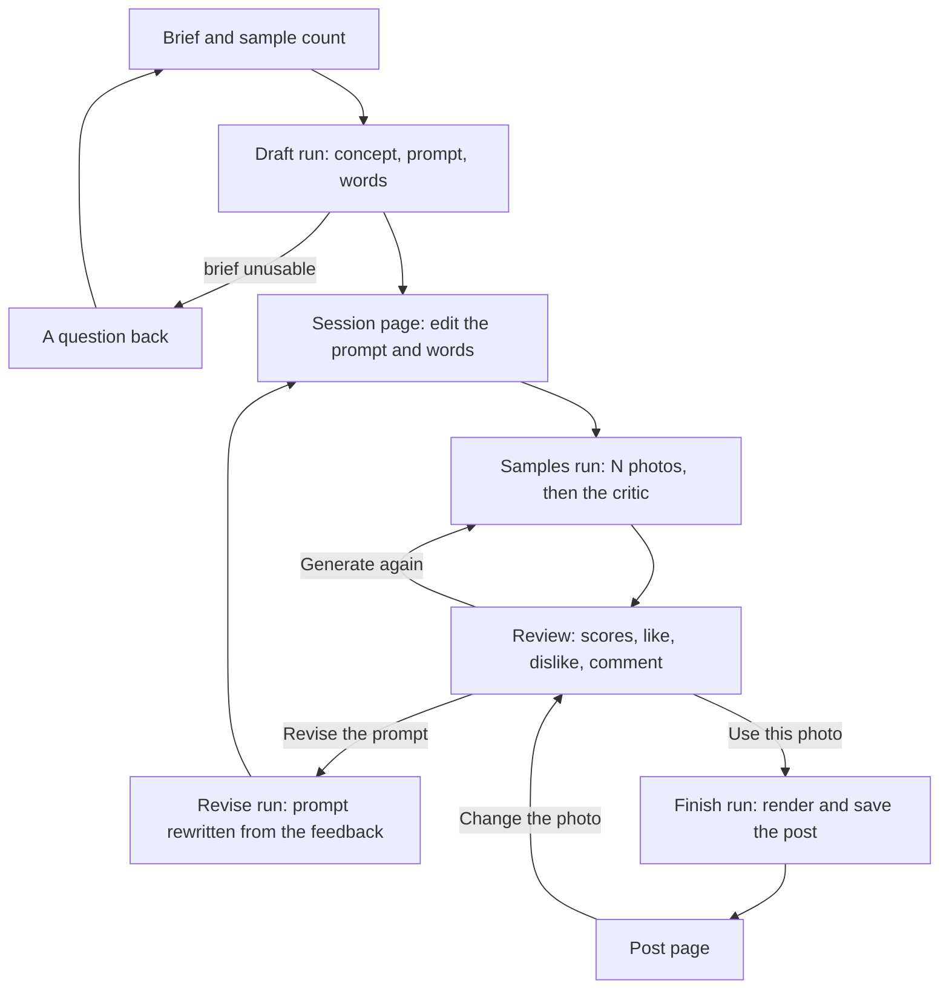

# Design Studio v2: design

Date: 2026-10-05. Status: draft for review. Builds on the v1 spec (`2026-10-05-design-studio-v1-design.md`), which stays the reference for everything v2 does not change.

## 1. What v2 is

v1 proved the loop: brief in, finished post out, with every step traceable. Testing it with real models showed the gap: one agent wrote a one-line photo prompt, the image model got one try, and the designer could neither see nor steer any of it. The posts came out bland and alike.

v2 puts the designer in the middle of the image work. A session now goes: brief → a detailed photo prompt the designer can edit → as many sample photos as they ask for → a critic's scores and the designer's own feedback → a better prompt, or a chosen photo → the finished post. Every generated photo is kept in an archive the designer controls. The studio also gets a dark theme.

### What Sahaj asked for, and where it lives

| Request | Where it lives in this design |
|---|---|
| A step that turns the vague brief into a detailed image prompt the designer can tinker with | The draft run and the session page (sections 3, 4, 6) |
| An input for how many sample images to make | The brief form and the session page; 1 to 6 a round (section 6) |
| Feedback on the generated samples, so the right image gets made | Per-sample reactions and a round comment, fed into the next prompt (sections 6, 7) |
| A critic agent for the samples | The critic step of the samples run (section 4) |
| An archive page of all generated images, with delete | The Archive page (section 6) |
| A tight dark theme toggle | The header toggle (section 6) |

### Assumptions to confirm

1. On the session page the designer can edit the headline, subline and caption too, not only the prompt. They are on the same page and cost little.
2. The Archive shows generated photos. Finished posts stay on the Studio page.
3. Deleting a photo removes the file for good; its record stays so runs remain traceable. A photo used by a post cannot be deleted while the post exists.
4. The v1 one-click "Generate" (brief straight to post) is replaced by the session flow. The comment-based "Revise" on a post stays, for words and layout only.
5. Default 3 samples a round, maximum 6, because the free photo allowance is roughly 40 to 70 a day.
6. The dark theme is for the studio's own pages. A post's dark or light mode is a design decision and is untouched.

### v2 is done when

| # | Check |
|---|---|
| 1 | A brief and a sample count start a session whose draft shows a concept, a detailed photo prompt and the words, all editable. |
| 2 | A brief that is not a brief (a pasted caption, an empty line) gets a question back instead of a prompt, and the session waits for a better brief. |
| 3 | Pressing Generate makes exactly the asked number of samples, shows them as a contact sheet, and each carries the critic's scores, flags and verdict. |
| 4 | Liking or disliking a sample, adding a comment, and pressing "Revise the prompt" gives a new prompt that names what to keep and what to change. |
| 5 | "Generate again" makes a new round from the current prompt; rounds stay visible, newest first. |
| 6 | "Use this photo" renders the post with it and opens the post page; the post page links back to its session. |
| 7 | The Archive lists every generated photo across sessions with its prompt, scores and feedback; filters work; "Delete selected" and "Delete all disliked" remove the files after a confirmation; a photo used by a post refuses deletion and says why. |
| 8 | The dark theme toggle switches every studio page, remembers the choice, and defaults to the system setting. |
| 9 | Every stage of a session is a run on the Runs page with its steps, providers and notes. |
| 10 | All of it works in demo mode on stand-ins, and the tests run offline. |

### Terms

| Term | Meaning |
|---|---|
| Session | One post's journey: a brief, its prompt versions, its rounds of samples, the feedback, and the finished post |
| Prompt version | One state of the photo prompt and the words, written by the agent or edited by the designer |
| Round | One press of Generate: N samples made from one prompt version |
| Sample | One generated photo, with the critic's review and the designer's reaction |
| Critic | The agent that scores a sample against the concept and the brand |

## 2. The designer's path

Each arrow out of a designer box is a button. Each run box is a run on the Runs page.

## 3. What changes in the architecture

The container, store, renderer, library, taste profile and model gateway stay as in v1. Three things change:

- **A session replaces the one-shot create run.** The pipeline is split into four short runs (draft, samples, revise, finish), each started by a button, with the session's state held in the studio's own tables. Nothing waits inside a workflow for a human; the human acts between runs. This keeps every run short, restartable and traceable, and avoids holding paused agent sessions in memory.
- **The art director is split.** The prompt writer owns the concept, the photo prompt and the words. The critic owns judgement. Code still owns order, fallbacks and rendering.
- **Photo providers make several samples at once**, one call per sample, in parallel, with a different seed each where the provider accepts one.

## 4. Agents and runs

| Agent | Owns | Reads | Writes |
|---|---|---|---|
| Prompt writer (draft) | Turning a brief into a concept, a detailed photo prompt and the words, or a question when the brief is unusable | Brief, brand feel and rules, taste summary, liked cards, up to 4 liked reference images and the kit's ideal example, the last 10 headlines | `PromptDraft` |
| Prompt writer (revise) | Rewriting the prompt from feedback | The current prompt version, the round comment, each reacted sample's reaction and critic verdict, a one-line summary of earlier rounds | `PromptDraft` |
| Prompt writer (words) | Revising only the words after a comment on a post | The post's words and the comment | `PromptDraft` with the prompt unchanged |
| Critic | Scoring one sample | The sample image, the prompt, the concept, the brand feel | `SampleReview` |
| Analyst | Unchanged from v1 | A reference image | `StyleCard` |

The prompt writer sees images (vision) so that "premium" and "restrained" mean what the liked references look like, not what their text cards say. This is my addition to Sahaj's list; it is one model call and the free tier allows it.

### Runs and their steps

| Run | Steps, in order | Notes |
|---|---|---|
| `draft` | `load_context` → `write_prompt` → `save_draft` | Unusable brief: the draft holds a question and the session waits |
| `samples` | `load_prompt` → `generate_samples` → `review_samples` → `save_round` | N provider calls in parallel, then one critic call per sample; one failed sample does not fail the round |
| `revise_prompt` | `load_feedback` → `rewrite_prompt` → `save_draft` | A new prompt version, author "agent after feedback" |
| `finish` | `load_pick` → `render` → `save_post` | The picked sample's file is the post's photo |
| `revise` | `load_context` → `rewrite_words` → `render` → `save_post` | Kept from v1 for words and layout; the photo is kept |

Step names appear on the run page in plain words: `load_context` "Gather context", `write_prompt` "Write the prompt", `save_draft` "Save the draft", `load_prompt` "Load the prompt", `generate_samples` "Make the samples", `review_samples` "Review the samples", `save_round` "Save the round", `load_feedback` "Read the feedback", `rewrite_prompt` "Rewrite the prompt", `load_pick` "Load the chosen photo", `rewrite_words` "Rewrite the words", `render` "Render", `save_post` "Save".

### The prompt the writer produces

A detailed prompt of 60 to 120 words in one paragraph, in this order: the subject and what it is doing; the setting and backdrop (matching the chosen mode's colour); light; lens and framing; colour and material; mood. It never asks for text, logos or watermarks, and it names what to avoid in positive terms ("a plain backdrop with nothing else in frame"). The writer also returns a one-line concept, the words, and a reason for the prompt. A prompt for the same brand must not repeat the subject or headline of the last ten posts unless the brief asks for it.

### The critic

For each sample the critic returns scores from 1 to 5 for on-brief, brand fit and craft; flags from a fixed list (`text_in_image`, `logo_in_image`, `distorted_anatomy`, `wrong_backdrop`, `busy`, `off_subject`); a one-sentence verdict; and one suggested change. Code computes the overall score (the mean) and marks the recommended sample: the highest overall with no `text_in_image`, `logo_in_image` or `distorted_anatomy` flag. The designer can always pick something else.

## 5. Data contracts

New or changed objects. Everything from v1 stays.

| Contract | Written by | Main fields |
|---|---|---|
| `StudioSession` | Session routes | Brand, brief, sample count (1 to 6), status (`needs_brief`, `drafted`, `generating`, `reviewing`, `finished`), current prompt version, picked sample, post id, timestamps |
| `PromptDraft` | Prompt writer | `usable`, `question`, concept (audience, idea, feeling, offer, tone), `photo_prompt`, mode, layout, headline, subline, caption, hashtags, `reason_prompt`, `reason_words` |
| `PromptVersion` | Session routes and runs | Session, number, the prompt and the words, author (`agent`, `designer`, `agent_after_feedback`), created |
| `Sample` | Samples run, archive routes | Session, prompt version, round, index, image path, provider, seed, `review` (a `SampleReview` or none), reaction (`liked`, `disliked`, `none`), comment, status (`candidate`, `picked`, `rejected`, `deleted`), used-in post id, created, deleted |
| `SampleReview` | Critic | `on_brief`, `brand_fit`, `craft`, `flags`, `verdict`, `suggested_change` |
| `RoundFeedback` | Session routes | Session, round, text, created |
| `Run` | Changed | Gains `session_id`; kinds are `draft`, `samples`, `revise_prompt`, `finish`, `revise` |
| `Post` | Changed | Gains `session_id` and `sample_id` |

Sample status rules: a sample starts as `candidate`; "Use this photo" makes it `picked` and the round's others `rejected`; a dislike makes it `rejected`; deleting it makes it `deleted` and removes the file.

## 6. Pages

**Studio.** The brief box gains a "Samples a round" number input (1 to 6, default 3) and a line "Photos made today: n". Start opens the session page. Recent posts stay.

**Session.** One page with three parts that fill in over time.
- *Brief and concept:* the brief (editable, with "Draft again"), the concept, and the agent's question when the brief was unusable.
- *Prompt and words:* the photo prompt in a large text box, the headline, subline, caption and hashtags in fields, mode and layout as choices, the sample count, and Generate. An edited prompt becomes a new prompt version by the designer when Generate is pressed. "Reset to the agent's version" is one link.
- *Rounds:* newest first. Each sample card shows the photo, the three scores and the overall, its flags as small labels, the verdict, a "recommended" mark, like and dislike buttons, a comment field, and "Use this photo". Under each round: a comment box and two buttons, "Revise the prompt with this feedback" and "Generate again". A failed sample shows its reason in place of the image.
- A session that is finished shows its post at the top with "Open the post" and "Change the photo".

**Post.** As v1, plus the session link, "Change the photo" (which goes to the session's rounds), and the sample's scores under the image.

**Archive.** A grid of every generated photo across sessions, newest first, with filters: all, liked, disliked, picked, not rated. Each card: the photo, its session and round, the prompt (first line, expandable), the overall score, the reaction, and a checkbox. Actions: "Delete selected" and "Delete all disliked", both with a confirmation that states the count. A photo used by a post shows "Used in a post" and is skipped by deletion, with a note saying how many were skipped.

**Runs.** Unchanged, plus a session link on session runs.

**Header.** A dark theme toggle on every page. The studio's pages use colour tokens with a dark and a light set; the choice is kept in the browser and defaults to the system setting. Posts are not affected.

## 7. The feedback loop, and what the agents are shown

Three loops now exist, from slow to fast:

- **Taste** (v1): likes on references shape every session.
- **Prompt revision** (new, per session): the designer's reactions and comment on a round, with the critic's verdicts, rewrite the prompt.
- **Direct edit** (new, per round): the designer edits the prompt text themselves.

What the reviser is shown is deliberately small, so the signal is not buried:
- the current prompt version and whether the designer edited it;
- the round comment, verbatim;
- for each reacted sample in the latest round: liked or disliked, the critic's verdict and flags ("keep what the liked ones share; avoid what the disliked ones share");
- one line per earlier round: how many samples, how many disliked, the comment;
- the concept and the brand feel.

It is not shown the whole history, other sessions, or unreacted samples. Its answer must say in `reason_prompt` what it kept and what it changed, and that line is shown on the session page.

Context cleaning rules, stated once:
1. The brief gate: a brief under 6 words, or one that reads as a caption or a finished sentence of marketing copy, gets a question instead of a prompt.
2. Prompts are capped at 120 words; longer answers are trimmed at a sentence boundary.
3. Critic verdicts are one sentence; suggested changes are one sentence.
4. The recent-headlines list is the last ten posts for the brand.
5. Only the latest round's reacted samples reach the reviser in full.

## 8. Models and budget

| Job | Model | Calls per session |
|---|---|---|
| Prompt writer | Gemini `gemini-3.5-flash-lite`, with up to 5 images | 1 per draft, 1 per revision |
| Critic | The same model, one image each | N per round |
| Samples | Cloudflare `flux-2-klein-4b` | N per round, in parallel |

A round of 3 costs 4 Gemini calls and 3 photo calls. With the free photo allowance of roughly 40 to 70 a day, that is about 15 rounds. The Studio and session pages show "Photos made today" so the designer can pace themselves. `STUDIO_MAX_SAMPLES` (default 6) caps a round.

## 9. When things fail

| What fails | What the studio does | What the designer sees |
|---|---|---|
| The brief is unusable | The draft run succeeds with a question | The question, and a box to improve the brief |
| One sample fails | The round continues with the rest | A card with the reason in place of the photo |
| Every sample fails | The round fails with the provider's reason | The reason and "Try again" |
| The critic fails for a sample | The sample is kept with no scores | "Not scored" on the card; picking still works |
| The photo allowance is used up | As above, with Cloudflare's reason | "Cloudflare's free daily allowance is used up." |
| The prompt reviser returns an unusable answer | One retry with the error, then the run fails | The error on the run page; the previous prompt stays current |
| Delete is asked for a photo used by a post | The photo is skipped | "Skipped 1 photo used by a post" |

## 10. Storage

New tables: `sessions`, `prompt_versions`, `samples`, `round_feedback`, each a few plain columns plus a JSON column, as in v1. Sample files live in `data/samples/<session>/<round>-<index>.png`. A deleted sample's file is removed; its row keeps `status = deleted` and `deleted_at`. Post images and reference images are unchanged.

## 11. Testing

| Area | What is tested |
|---|---|
| Brief gate | A pasted caption and an empty brief get a question; a real brief gets a prompt |
| Draft | The fake prompt writer's prompt is 60 to 120 words, names the mode's backdrop, and contains no "text" or "logo" request |
| Samples | A round of N makes N files; one failing sample leaves N−1 and a reason; all failing fails the round with the reason; the fake provider gives different images for different seeds |
| Critic | The fake critic returns valid reviews; the recommended sample is the highest overall without a hard flag; a critic failure leaves a sample unscored |
| Feedback | A dislike with a comment produces a new prompt version by "agent after feedback" whose `reason_prompt` names the comment; the reviser's context holds only the latest round's reacted samples |
| Designer edit | An edited prompt becomes a designer-authored version and is what the provider receives |
| Finish | "Use this photo" renders a post whose photo is the picked sample; the post links to the session |
| Archive | Filters, selection, delete removes the file and keeps the row, "Delete all disliked" skips used photos and reports the count |
| Theme | The toggle sets the attribute the tokens key on, and the choice survives a reload |
| Runs | Each stage records its steps with the right names and providers |

## 12. Decisions and rejected options

| Decision | Why | Rejected |
|---|---|---|
| Four short runs with the human between them | Each run stays short and traceable; nothing paused lives in memory | One long workflow that waits for the human (ADK's interrupt support): more to get right, harder to restart |
| The prompt writer sees reference images | "Premium" is a look, not a word | Text cards only, as in v1 |
| The critic scores; code recommends; the designer picks | Judgement is visible and overridable | Auto-picking the best sample |
| Reviser sees only the latest round's reactions | A small, strong signal beats a long history | Full history in the prompt |
| Delete removes the file, keeps the row | The archive honours the request; the runs stay honest | Hard-deleting rows; never deleting |
| Samples made in parallel | A round of 3 takes about 25 seconds, not 75 | Sequential calls |
| Theme in CSS tokens with one attribute | One switch, no second stylesheet | Two stylesheets |

## 13. Not in v2

Learning taste from sample reactions across sessions; live reference sources; a second sample brand; the claims check; README, DESIGN.md, Archify diagrams and the video (v3); image-to-image or reference-image conditioning of the photo model; editing the photo (crop, retouch).

## 14. Build order

Two checkpoints, each ending with the app running for Sahaj to test.

- **Checkpoint A, the loop:** sessions, the draft run with the brief gate, the session page with the editable prompt and words, the sample count, the samples run without the critic, reactions and round comments, the revise run, finish, and the post page links. About half a day.
- **Checkpoint B, judgement and control:** the critic, the Archive with delete, the dark theme, "Photos made today". About half a day.

## 15. Open questions

1. The six assumptions above.
2. Should a disliked sample be hidden from the session page once a new round exists, or stay visible? (Design: stays visible, greyed.)
3. Should "Generate again" reuse the exact prompt, or ask the reviser for a light variation? (Design: exact prompt, new seeds.)
