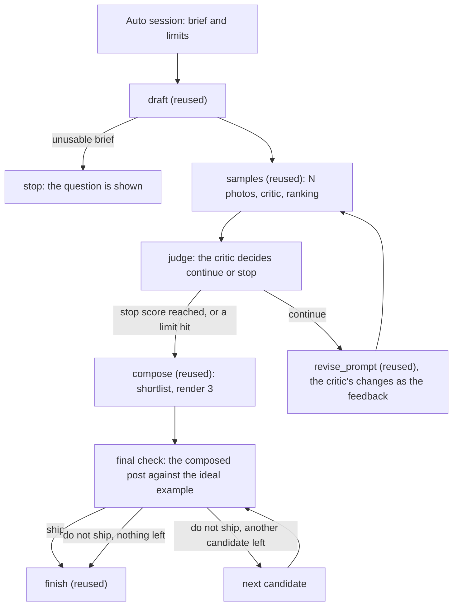

# Design Studio v3: auto mode and the editor

Date: 2026-10-06. Status: draft for review. Builds on the v2.1 spec; everything not mentioned stays as it is. The hand-in work (README, DESIGN.md, Archify diagrams, committed samples, first commits) is a separate track and is not changed by this document.

## 1. What v3 is

Two features at the two ends of control:

| Feature | Who drives | What it adds |
|---|---|---|
| **Auto mode** | The model, inside limits that code owns | A bounded loop that drafts, samples, judges, revises, composes, checks the finished post and hands over a result with the whole trace |
| **The editor** | The designer | A canvas where the words, logo and a shade are placed freely over any photo from the archive or an upload, while the kit still decides fonts, colours and the logo |

Manual mode (v2.1) stays as it is and sits between them.

### Assumptions to confirm

1. Auto mode is chosen per session on the Studio page, with three limits visible: rounds (default 3), photo budget (default 6), stop score (default 4.2 of 5).
2. The model judges whether to continue and what to change; code enforces the limits and the hard-flag rule; the designer can press Stop at any time, and the session becomes a manual session at that point.
3. An auto session always ends with a finished post (best effort), never with a question. An unusable brief is the one exception and stops at once.
4. The editor starts from a chosen photo (a sample, an archive photo or an upload) and from a template candidate's positions when there is one; otherwise from a default arrangement.
5. The editor's guardrails are hard: the kit's font only, palette colours only, the logo never stretched and never narrower than 14% of the canvas, text never outside a 4% margin.
6. An uploaded image becomes a sample of that session (round 0, source "upload"), so the archive and delete rules apply to it.

### v3 is done when

| # | Check |
|---|---|
| 1 | Starting an auto session with a real brief ends, without any click, in a finished post, and the session page shows each round's decision in one line ("Round 1: top 3.7 under 4.2, revising: softer light, no metal"). |
| 2 | The loop stops early when the top sample reaches the stop score with no hard flag, and never exceeds the rounds or the photo budget. |
| 3 | The finished post gets a final check from the vision model (ship yes or no, score, biggest flaw); a "no" with budget left tries the next layout once. |
| 4 | Stop during an auto run leaves a manual session with everything made so far. |
| 5 | The Runs page shows the auto run with its decision steps and links to every child run. |
| 6 | The editor opens on a chosen photo; the headline, subline and logo can be dragged and resized; a shade block can be added; the text colour comes from the palette; the font is the kit's. |
| 7 | Preview renders the custom layout through the normal renderer as a candidate; Use this layout makes the post; reopening the editor on that candidate restores the arrangement. |
| 8 | An upload becomes a round-0 sample and can be composed, edited and deleted like any other. |
| 9 | The guardrails hold: a block cannot leave the margin, the logo cannot be stretched, a colour outside the palette cannot be chosen. |
| 10 | Everything runs in demo mode on the stand-ins; the suite passes. |

## 2. Auto mode

### The loop



Code owns the rounds limit, the photo budget, the stop score, the hard-flag rule and the order of candidates. The model owns whether a round is good enough, what to change in the prompt, and whether the finished post ships.

### Contracts

```python
SessionMode = Literal["manual", "auto"]

class AutoSettings(BaseModel):
    max_rounds: int = 3            # 1 to 5
    photo_budget: int = 6          # 1 to 12, photos for the whole session
    stop_score: float = 4.2        # the top sample's overall score, 1 to 5

class RoundJudgement(BaseModel):   # the critic's answer in the judge step
    good_enough: bool
    reason: str
    changes: list[str]             # what the reviser should change, one line each; empty when good enough

class FinalReview(BaseModel):      # the critic's answer in the final check
    ship: bool
    score: int                     # 1 to 5
    biggest_flaw: str
    fix_hint: str                  # one line the designer or the loop can act on

class AutoState(BaseModel):
    rounds_done: int = 0
    photos_used: int = 0
    decisions: list[str] = []      # one line per decision, shown on the session page
    stopped_by: Literal["score", "rounds", "budget", "designer", "brief", "error"] | None = None
    final_review: FinalReview | None = None
```

`StudioSession` gains `mode`, `auto_settings` and `auto_state`. `Run` gains `parent_run_id`; `RunKind` gains `auto`. `RoundFeedback` gains `author: Literal["designer", "critic"]`, so the reviser's context says who asked for the change. `Post` gains `auto_summary: str`.

### Steps of the auto run

One ADK `Workflow`, `auto_round`, whose function steps call the existing stage functions. Each stage still records its own child run, with `parent_run_id` set, so the Runs page shows the whole tree. The loop is a dynamic step (`@node(rerun_on_resume=True)`) that awaits the judge agent with `ctx.run_node`, the proven v2 pattern.

| Step | Does |
|---|---|
| `plan` | Validates the limits, writes `auto_state`, note `Up to 3 rounds and 6 photos, stop at 4.2.` |
| `draft` | `run_draft` as a child run. Unusable brief: `stopped_by = "brief"`, the run ends succeeded with the question shown, the mode flips to manual. |
| `round_loop` | For each round while the limits allow: `run_samples` as a child run, its size `min(session.sample_count, photo_budget − photos_used)`; then the judge. Good enough, or a limit reached: leave the loop. Otherwise save `RoundFeedback(author="critic", text=the changes joined)`, run `run_revise_prompt` as a child run, and continue. |
| `judge` (inside the loop) | The critic agent with `output_schema=RoundJudgement`. Context: the round's ranking and reviews, the stop score, the prompt, the concept, the brand feel. Instruction: say whether the top sample is good enough to compose (no hard flag, and a designer would not be embarrassed to post it); when not, give the concrete changes the prompt should make, drawn from the samples' weaknesses. Code overrides a "good enough" when the top sample has a hard flag or its overall is under the stop score, and records why. One line goes to `auto_state.decisions`. |
| `compose` | `run_compose` as a child run with the top-ranked sample. |
| `final_check` | The critic agent with `output_schema=FinalReview`. Message: the composed candidate's PNG preceded by `The finished post`, and the kit's ideal example preceded by `The brand's quality bar`. Context: the concept, the brand feel, the words. Instruction: would this ship as it is; score it; name the biggest flaw and a one-line fix. Code: `ship` false and another candidate exists → check the next candidate once; else continue with the better score. |
| `finish` | `run_finish` as a child run with the chosen candidate. The post's `auto_summary` reads `Made automatically: 2 rounds, 4 photos, final check 4 of 5.` |
| `report` | Writes the summary to the session and the run; the mode flips to manual. |

Photo prompts leave room for the words. The prompt writer's context gains `layout_hint` and `text_position`, and its instruction says to keep that third of the frame plain (backdrop only) when the hint is `full_bleed` or `caption_strip`. This applies in manual mode too; it is the one-line change from the earlier review.

### Failure behaviour

| What fails | What the studio does | What the designer sees |
|---|---|---|
| Photo allowance used up mid-loop | Stops the loop, composes with the best sample so far; none at all → a type-only post | "Stopped: no photo allowance left" in the decisions |
| The judge fails twice | Treated as stop and compose | "The critic could not judge this round, so it was composed as it is" |
| The final check fails | The post is finished without it | "Final check skipped" on the post |
| The designer presses Stop | The child run in flight is cancelled (v2.1 rules); the session becomes manual at its current state | The session page in manual mode with everything made so far |
| Any stage fails | The auto run fails with that stage's message; the session becomes manual | The error and the child run link |

### Pages

- **Studio:** a Manual or Auto switch next to the brief; in Auto, the three limits as small inputs with their defaults and the line `Auto mode makes up to 6 photos on its own.`
- **Session (auto):** the status line reads `Auto: round 2 of 3, 4 of 6 photos`; the decisions list grows live; Stop is always visible. When finished, the finished panel shows the final check (`Final check: 4 of 5. Biggest flaw: the shade is slightly heavy.`) and the manual controls appear, since the session is manual once the run ends.
- **Post:** the `auto_summary` line above the reasons.
- **Runs:** the auto run lists its decision steps and its child runs; each child run shows `Part of auto run …` with a link.

### Budget

An auto session of 3 rounds of 2 samples costs about 6 photos and about 12 Gemini calls (1 draft, 3 rounds × (2 critic + 1 rank + 1 judge), 2 revisions, 1 final check). Within the free tiers that is about 7 auto sessions a day.

### Implementation steps

1. **Contracts** (`studio/contracts.py`): `SessionMode`, `AutoSettings`, `RoundJudgement`, `FinalReview`, `AutoState`; the fields on `StudioSession`, `Run`, `RoundFeedback` and `Post`; `RunKind` gains `auto`.
2. **Store** (`studio/store.py`): `list_runs_for_parent(run_id)` with `json_extract`; `count_photos_for_session(session_id)`.
3. **Stand-ins** (`studio/models.py`): `ROLE_JUDGE` answers `RoundJudgement` (good enough when the context's `top_overall` is at least `stop_score`, otherwise two canned changes); `ROLE_FINAL_CHECK` answers `FinalReview` (ship true, score 4, flaw `Demo mode: no model looked at the post.`).
4. **Agents** (`studio/workflows/agents.py`): `build_judge(llm)` and `build_final_checker(llm)` with the instructions above; the prompt writer's `layout_hint` and `text_position` rule.
5. **Stage functions** (`studio/workflows/session.py`, `layouts.py`): accept `parent_run_id` and set it on the child run; the samples run accepts a `count` override; the reviser's context names the feedback's author.
6. **The auto run** (`studio/workflows/auto.py`): `run_auto(deps, run, session) -> Post | None`; the workflow with the steps above; the loop as a dynamic step; the limit checks in code; cancellation keeps the v2.1 rules and flips the mode to manual.
7. **Routes and pages** (`studio/web/`): the mode switch and limits on the Studio form; `/sessions` starts `run_auto` when the mode is auto; the session page's auto status, decisions and Stop; the post's summary; the run page's tree; `/api/sessions/{id}` returns `auto_state`.
8. **A demo run-through**, then one real auto session with 2 samples a round.

## 3. The editor

### What it is

A page where the designer arranges a post by hand on a chosen photo. It produces a `custom` composition that the normal renderer draws, so the output is still a 1080×1350 PNG in the kit's font and colours, still goes through the fit report and the contrast measurement, and still becomes a candidate the finish run can use.

### Contracts

```python
BlockKind = Literal["headline", "subline", "logo", "shade"]

class Block(BaseModel):
    kind: BlockKind
    x: float            # left edge, percent of the canvas width, 0 to 100
    y: float            # top edge, percent of the canvas height
    w: float            # width, percent of the canvas width
    h: float = 0        # height, percent; shade only (text takes its natural height)
    align: TextAlign = "left"   # text only
    size_px: int = 0            # text only; 0 means the template default
    colour: str = ""            # a palette colour name; text and shade only
    opacity: float = 0.7        # shade only

class CustomLayout(BaseModel):
    blocks: list[Block]
    photo_fit: Literal["cover", "contain"] = "cover"
    photo_offset_x: float = 0   # percent; pans the photo under cover
    photo_offset_y: float = 0
    background: str = ""        # a palette colour name; the canvas behind the photo

# LayoutTemplate gains "custom"; Composition gains `custom: CustomLayout | None`
```

Guardrails enforced in the renderer, not only on the page: the font is the kit's; a colour name outside the palette falls back to the mode's role colour; the logo keeps its proportions and is never narrower than 14% of the canvas; every block is clamped into a 4% margin. The render report lists each clamp as an adjustment line.

### The page

`GET /sessions/{id}/editor?sample={sample_id}&from={candidate_id}` (`from` is optional)

- Left: the canvas, the photo at 540 by 675 (half size), blocks drawn as draggable, resizable boxes in the real font at half size, so what the designer sees is what the renderer draws.
- Right: a panel for the selected block: the text (the headline and subline fields are the version's words and stay in sync with it), size, alignment, colour (palette swatches with names), opacity for a shade; `Add a shade`; the photo controls (fit, pan with arrows, background colour); the logo size.
- Bottom: `Preview` (renders the custom composition as a new candidate in about a second and shows it), `Use this layout` (finish), `Back to the session`.
- Starting arrangement: from the candidate in `from` when it is a template candidate (each template maps its slots to blocks in a small table in `compose.py`); otherwise headline bottom-left, subline under it, logo top-left, no shade.
- No framework: vanilla JavaScript with pointer events; positions kept as percentages; the panel writes hidden form fields; Preview posts the JSON.

### Assets

- `POST /sessions/{id}/upload` (an image file, PNG or JPEG, at most 15 MB): saved under `data/uploads/<session>/`, and becomes a `Sample` of round 0 with `provider = "upload"`, status candidate, no review. It appears on the session page under `Your photos` with `Compose with this photo` and `Open in the editor`.
- `Open in the editor` also appears on every sample card and on archive cards.

### Failure behaviour

| What fails | What the studio does | What the designer sees |
|---|---|---|
| A block is dragged out of the margin | Clamped on the page and again in the renderer | The block snaps back; the report lists the clamp |
| The text does not fit its box | The fit script reports it; no automatic resize in a custom layout | A warning on the candidate: `The headline overflows its box.` |
| The upload is not an image, or is too large | Refused | `That file is not an image the studio can use.` |
| Preview fails to render | The run fails with the renderer's message | The error on the editor page |

### Implementation steps

1. **Contracts** (`studio/contracts.py`): `Block`, `CustomLayout`, `custom` on `Composition`, `custom` in `LayoutTemplate`.
2. **Renderer** (`studio/render/`): `custom.html` with absolutely positioned blocks (percent coordinates, CSS variables for size and colour); the guardrails in `build_html` (clamping, palette lookup, the logo minimum); the fit script extended to report each text block; the contrast measurement per text block (reuse the cover-fit maths; report, do not auto-shade); `compose.py`: `blocks_for_template(composition) -> CustomLayout` for the starting arrangement, and `describe()` returns `Custom layout`.
3. **Store** (`studio/store.py`): `uploads_dir`. Candidates and samples already hold the rest.
4. **Routes** (`studio/web/routes.py`): the editor page; `POST /sessions/{id}/editor/preview` (a JSON body → `run_compose` with that one custom composition); `POST /sessions/{id}/upload`; the editor links on sample and archive cards.
5. **Page and script** (`studio/web/templates/editor.html`, `static/editor.js`, `app.css`): the canvas, drag and resize with pointer events, the panel, the half-size font, the hidden fields, the margin clamp.
6. **A demo run-through** (upload, arrange, preview, finish, reopen), then a real one.

## 4. Decisions and rejected options

| Decision | Why | Rejected |
|---|---|---|
| Auto mode is a bounded code loop in which the model judges and proposes changes | Predictable, traceable, cheap; it answers "what decides what happens next" with a real agent decision | A tool-calling coordinator (`LlmAgent` with generate, critique and revise tools): more calls, harder to trace, loses the limits |
| Child runs stay separate runs with a parent link | Every stage keeps its own trace; the Runs page shows a tree | One giant run with dozens of steps |
| Auto hands over a finished post, not a choice | That is what "take control" means; the designer can still revise afterwards | Stopping at the compose step for a pick |
| The editor produces a composition the normal renderer draws | One renderer, one report, one candidate type; the guardrails live in code | A separate canvas export: exact what-you-see, but the brand rules would live in JavaScript |
| Guardrails are hard | The kit is the source of truth; the assessment asks for posts that follow the brand | Free fonts and colours with a warning |
| Uploads become samples | The archive, delete and reuse rules keep working | A separate asset table |

## 5. Not in v3

Learning taste from reactions across sessions (the embedding taste model); live reference sources; editing the photo itself (crop, retouch, background removal); multi-page posts; scheduling or publishing.

## 6. Build order and time

- **Checkpoint A, auto mode:** steps 1 to 8 of section 2. About half a day.
- **Checkpoint B, the editor:** steps 1 to 6 of section 3. About three quarters of a day.
- The hand-in track (README with screenshots, DESIGN.md, Archify diagrams, committed samples, first commits under sahajm99) needs about half a day and must come before Thursday evening. If time runs short, the editor ships as drag and resize only (no upload, no shade), and the rest goes into DESIGN.md under "next week".
