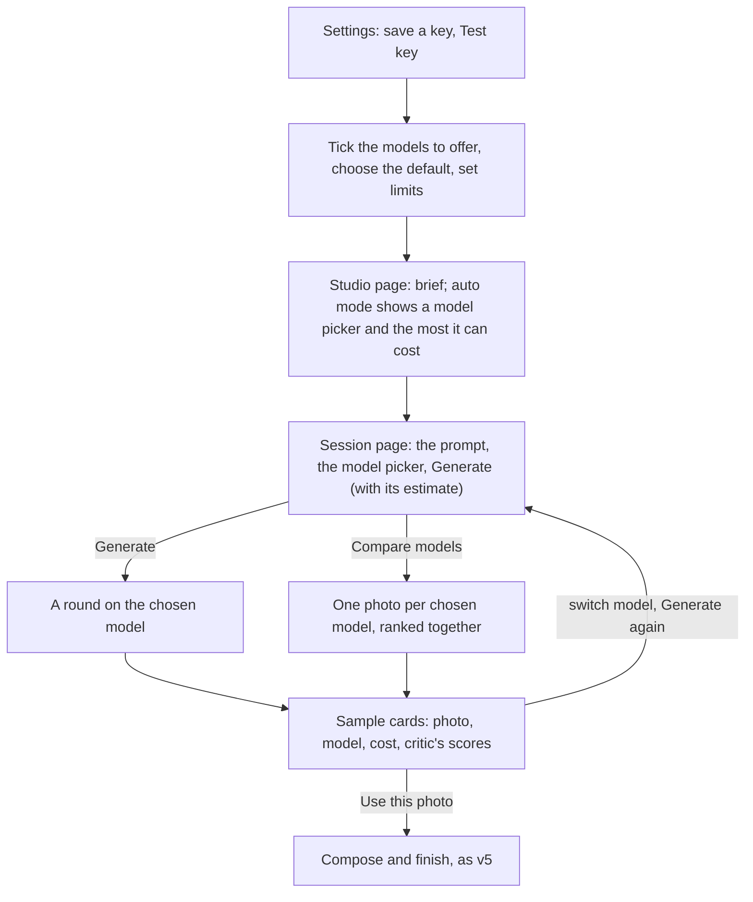
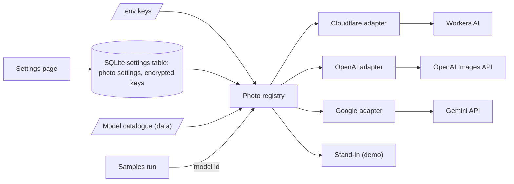
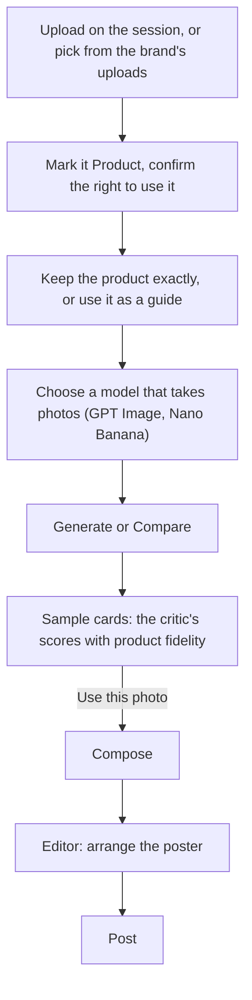

# Design Studio v6: image models, your own keys and product photos

Date: 2026-10-08. Status: draft for review. Builds on v5 (`2026-10-08-design-studio-v5-design.md`, as committed at 8e672fc); everything not mentioned stays as it is.

v6 has two parts. Part A, sections 1 to 18, is image models and your own keys. Part B, sections B1 to B11 at the end, is product photos the image model sees; it builds on Part A's adapters and on v5's references and uploads.

## 1. What v6 is

Today the studio has one photo source, chosen once at start-up from `.env`: Cloudflare's free FLUX.2 klein, or the stand-in in demo mode. The Onyx comparison on 2026-10-08 showed that the photo model decides most of a poster's quality. The same prompt and the same Hero layout gave anatomy errors on the free model, and lifelike prostheses on OpenAI's GPT Image 2.5 Flare and Google's Nano Banana 2.1, at about $0.05 a photo each. That run used a script outside the studio (`scripts/make_photos.py`) and uploads; v6 brings it into the studio.

v6 adds:

| # | Change | In one line |
|---|---|---|
| 1 | Three providers, many models | Cloudflare, OpenAI and Google behind one registry; each provider is one adapter, each model one line of a catalogue |
| 2 | A Settings page | Save each provider's key (encrypted, never shown again), test it for free, choose which models appear, set the default and the daily limits |
| 3 | A model on every round | The session page's Generate gains a model picker; auto mode gains one on the Studio page |
| 4 | Compare models | One round makes one photo per chosen model from the same prompt, side by side, scored and ranked by the critic |
| 5 | Cost in plain sight | Every photo records its model and cost; the Generate button shows the estimate; today's spend is on the Studio page; daily limits stop a runaway |
| 6 | Safer local serving | The studio answers only on this machine, and refuses requests from other sites, because a button can now spend money |
| 7 | Product photos the image model sees (Part B) | Mark a photo of the real product, and the image model keeps that product and makes a new scene around it; the critic checks it stayed true |

Five rules hold throughout:

1. **Free by default.** Cloudflare stays the default model, and a fresh clone with no keys runs exactly as v5. The assessment requires a studio that runs free; paid models are an option on the user's own key.
2. **Your key, your bill, and you see it before you spend.** Every paid choice shows its price; nothing paid runs without a key the designer saved or put in `.env`.
3. **A saved key never leaves the server.** It is encrypted at rest, never sent back to the browser, never logged and never shown in an error.
4. **Providers are adapters; models are data.** A new model of a known provider is one catalogue entry; a new provider is one file.
5. **Workflows ask the registry, never a provider directly.** A round names a model id; the registry turns it into a working adapter with its key.

### Assumptions to confirm

1. Settings are studio-wide, not per brand. A brand kit does not choose a model in v6.
2. Each model has one preset of options set on the Settings page (OpenAI quality, Google image size). The session page picks a model, not its options.
3. The Google image key is separate from the text key in `.env` (`GOOGLE_API_KEY`). Google's image models have no free tier, and billing is set per Google project, so keeping image generation in its own billed project keeps the text calls free.
4. A saved key wins over the same provider's key in `.env`; `.env` keys still work, and the page says which one is in use.
5. The secret that encrypts saved keys comes from `STUDIO_SECRET_KEY` in `.env`; when it is absent, the studio makes one on first start and keeps it in the database volume.
6. A compare round takes two or three models and makes one photo with each.
7. Daily limits default to 30 photos a day for each paid provider and $2.00 a day across all of them.
8. In auto mode, a paid model that fails, or reaches a daily limit, hands the rest of the session to the free default, with a decision line. Manual rounds never switch models on their own.

### v6 is done when

| # | Check |
|---|---|
| 1 | With no keys at all, the studio runs as v5: Cloudflare (or the stand-in in demo mode), no paid model offered, the Settings page shows each provider as "Not set up". |
| 2 | Saving an OpenAI key on the Settings page and pressing "Test key" shows "The key works. 10 image models are visible." with no charge; the key's last four characters show, never the rest. |
| 3 | The saved key is not readable in `studio.db` (no plain text), not in any page's HTML, not in the container log, and not in a run's step notes. |
| 4 | The session page's model picker lists only the enabled models whose provider has a key, each with its price ("GPT Image 2.5 Flare · about $0.05 a photo", "FLUX.2 klein · free"). |
| 5 | A round made with GPT Image 2.5 Flare saves photos whose cards say "GPT Image 2.5 Flare · $0.048"; the run page's step names the model and the round's total cost. |
| 6 | "Compare models" with three models makes three photos from the same prompt, one per model, scored and ranked together; the round's header lists the models and costs. |
| 7 | An auto session started with Nano Banana 2.1 makes every round's photos with it; the Studio page's estimate before starting says the most it can cost. |
| 8 | A refused key, used-up credit, a model the key cannot use, billing missing on the Google project, and a safety refusal each give their own plain message on the sample card, and the round carries on with the photos that were made. |
| 9 | Reaching the daily photo limit or the daily spend limit stops further paid photos with a message that names the limit; in auto mode the session finishes on the free default and says so. |
| 10 | The Studio page shows "Photos made today: n · Spent today: $x.xx"; the Settings page's Usage part shows photos and spend per provider for today and this month. |
| 11 | The studio answers on 127.0.0.1 only; a POST whose Origin or Referer is another site gets 403; a request whose Host is not localhost gets 400. |
| 12 | Removing a key takes its models out of every picker; a session whose model lost its key falls back to the default and says so. |
| 13 | Everything works in demo mode on the stand-ins; the suite passes. |

## 2. The designer's path



## 3. What changes in the architecture



| Part | Change |
|---|---|
| `studio/photos/catalogue.yaml` (new) | The models, as data (section 4) |
| `studio/photos/catalogue.py` (new) | `ImageModel`, `load_catalogue()`, validation at start-up |
| `studio/photos/openai.py`, `google.py` (new) | One adapter each (section 5) |
| `studio/photos/cloudflare.py`, `fake.py` | Take the model from the catalogue entry; report cost |
| `studio/photos/registry.py` (new) | `PhotoRegistry`: which models are usable now, the adapter and key for a model id, daily limits, usage |
| `studio/secrets.py` (new) | Encrypt and decrypt saved keys (section 6) |
| `studio/photos/base.py` | The interface gains the model and its options; `PhotoResult` gains cost and usage |
| `studio/config.py` | `secret_key`, `openai_api_key`, `google_image_api_key` from `.env`; `photo_provider` stays as an override for tests |
| `studio/main.py` | Builds the registry instead of one provider; `Deps.photos` replaces `Deps.photo_provider` |
| `studio/workflows/session.py`, `auto.py` | A round reads its model id from the session; a compare round makes one photo per model |
| `studio/store.py` | Settings keys `photo_settings` and `provider_keys`; usage queries (section 8) |
| `studio/web/` | The Settings page, the guards, the pickers, badges and counters |
| `docker-compose.yml` | `127.0.0.1:8000:8000` |
| `.env.example` | `STUDIO_SECRET_KEY` (with how to make one), `GOOGLE_IMAGE_API_KEY`; `OPENAI_API_KEY` is already there |
| `requirements.txt` | `cryptography>=44,<51`, already in the image at 50.0.2, so no rebuild is needed |

## 4. The model catalogue

One file, `studio/photos/catalogue.yaml`, read and validated at start-up. A new model of a known provider is one entry. Prices are list prices checked on 2026-10-08; the studio records the actual cost where the provider reports usage, and the list price otherwise.

| Provider | Model id | Label | Preset options | Price basis | List price a photo |
|---|---|---|---|---|---|
| cloudflare | `@cf/black-forest-labs/flux-2-klein-4b` | FLUX.2 klein | size in multiples of 32 | free daily allowance | free |
| openai | `gpt-image-2.5-flare` | GPT Image 2.5 Flare | quality high; size 1088 x 1360 | usage: $30 per million output tokens | about $0.05 (measured $0.048) |
| openai | `gpt-image-2.5-sunburst` | GPT Image 2.5 Sunburst | quality high | usage: $30 per million output tokens | about $0.05 |
| openai | `gpt-image-2` | GPT Image 2 | quality high | usage: $30 per million output tokens | about $0.05 |
| openai | `gpt-image-1-mini` | GPT Image 1 mini | quality medium | usage | lower; check before enabling |
| google | `gemini-nano-banana-2.1` | Nano Banana 2.1 | image size 2K; aspect 4:5 | list price | $0.0504 (2K), $0.0336 (1K) |
| google | `gemini-3.1-flash-image` | Nano Banana 2 | image size 1K | list price | $0.067 |
| google | `gemini-3.1-flash-lite-image` | Nano Banana 2 Lite | image size 1K | list price | check before enabling |
| google | `gemini-3-pro-image` | Nano Banana Pro | image size 1K | list price | $0.134 |

What was verified, and how:

| Fact | How |
|---|---|
| These model ids are visible to a working key | `scripts/make_photos.py --list-models openai` and `gemini`, 2026-10-08 (free calls) |
| GPT Image 2.5 Flare accepts `size: 1088x1360`, `quality: high`, returns `b64_json` and `usage.output_tokens` | A real call, 2026-10-08: 1,587 output tokens, $0.048 |
| Nano Banana 2.1 accepts `imageConfig.aspectRatio: 4:5`, `imageSize: 2K` and returns `inlineData` | A real call, 2026-10-08 |
| Workers AI accepts 1024 x 1280 for FLUX.2 klein | A real call, 2026-10-08 |
| Google's image models have no free tier; grounding on 3.5 Flash-Lite neither | Google's pricing page, 2026-10-08 |
| OpenAI's per-image price at other qualities and sizes | Not measured; the studio shows "about" until a photo reports its usage |

```python
ProviderId = Literal["cloudflare", "openai", "google", "fake"]
PriceBasis = Literal["free_allowance", "usage", "list_price"]

class ImageModel(BaseModel):
    id: str                       # the provider's own model id
    provider: ProviderId
    label: str                    # "GPT Image 2.5 Flare"
    price_basis: PriceBasis
    list_price_usd: float = 0.0   # per photo at the preset; 0 for free
    output_token_price_usd: float = 0.0   # per token, for usage-priced models
    options: dict[str, str] = {}  # the preset: {"quality": "high"} or {"image_size": "2K"}
    option_choices: dict[str, list[str]] = {}   # what Settings may change the preset to
    max_parallel: int = 3         # photos asked for at once on this provider
    checked: str = ""             # "2026-10-08": when the price was checked
```

## 5. The provider adapters

```python
class PhotoProvider(Protocol):
    name: ProviderId

    async def generate(
        self, prompt: str, width: int, height: int, out_path: Path, *,
        model: ImageModel, options: dict[str, str], seed: int | None = None,
    ) -> PhotoResult: ...

    async def test_key(self) -> KeyCheck: ...      # free: lists models, makes no photo

class PhotoResult(BaseModel):
    path: str
    provider: str          # "openai:gpt-image-2.5-flare", as today's "cloudflare:flux-2-klein-4b"
    model_id: str
    prompt: str
    cost_usd: float | None # None when unknown
    cost_basis: PriceBasis
    usage: dict[str, int] = {}   # the provider's own counts, when it reports them

class KeyCheck(BaseModel):
    ok: bool
    message: str           # plain words, never the key
    visible_models: list[str] = []
```

Each adapter owns one HTTP client, sends the key in a header (never in the address), maps sizes, parses the answer, works out the cost, and turns every failure into a `PhotoUnavailable` with a plain message.

| | OpenAI | Google | Cloudflare (today, extended) |
|---|---|---|---|
| Request | `POST /v1/images/generations`, JSON: `model`, `prompt`, `size`, `quality`, `n: 1`, `output_format: png` | `POST /v1beta/models/{id}:generateContent`, header `x-goog-api-key`; `responseModalities: ["IMAGE"]`, `imageConfig: {aspectRatio, imageSize}` | `POST /accounts/{id}/ai/run/{model}`, multipart `prompt`, `width`, `height` |
| Size | the post size rounded up to multiples of 16 (1080 x 1350 gives 1088 x 1360) | the nearest supported aspect ratio to the post (4:5) and the preset image size | multiples of 32, as today |
| Answer | `data[0].b64_json`, `usage.output_tokens` | the first `inlineData` part; `finishReason` | `result.image` |
| Cost | output tokens x the catalogue's token price | the catalogue's list price | 0 (free allowance) |
| Timeout | 300 s | 180 s | 180 s, one retry on timeout (as today) |
| Key test (free) | `GET /v1/models`: the image models visible | `GET /v1beta/models`: the image models visible | `GET /accounts/{id}/ai/models/search`, or token verify (to confirm in the first step) |

One photo per request on every provider, so one failure costs one sample, and the round's parallel requests are held to the model's `max_parallel`.

**After the photo arrives, for every provider.** If the top and bottom rows of the image are a flat band (a letterbox: Nano Banana framed one Gen 5 photo this way), the band is trimmed before saving, and the step note says so.

### Plain messages, by what the provider said

| Provider's answer | What the sample card says |
|---|---|
| 401, or an invalid-key error | "The {provider} key was refused. Check it in Settings." |
| OpenAI 403 that mentions verification | "OpenAI asks your organisation to verify itself before this model can be used. Settings in your OpenAI account, Organization, Verify." |
| Google 403, or an error that mentions billing | "This model needs billing on your Google project. Google's image models have no free tier." |
| OpenAI 429 `insufficient_quota` | "Your OpenAI credit is used up." |
| 429 rate limit | One wait as the answer asks (at most 20 s), one more try, then "{provider} is busy. Try again in a minute." |
| A safety refusal (OpenAI moderation, Google `SAFETY` or `IMAGE_SAFETY`) | "The model declined this prompt." plus its one-line reason when it gives one |
| A model the key cannot use (404, or not in the key's list) | "This key cannot use {label}. Untick it in Settings, or use another key." |
| 5xx | One more try, then "{provider} had a problem making this photo." |
| No image in the answer | "{provider} answered without a photo." |

## 6. Keys and settings storage

**Where keys come from, in this order:** a key saved on the Settings page; else the provider's key in `.env` (`CLOUDFLARE_ACCOUNT_ID` and `CLOUDFLARE_API_TOKEN`, `OPENAI_API_KEY`, `GOOGLE_IMAGE_API_KEY`); else none, and the provider's models are hidden from every picker.

**Encryption.**
- Saved keys are encrypted with Fernet from `cryptography` (authenticated symmetric encryption) and stored as one blob in the `settings` table under `provider_keys`.
- The secret is `STUDIO_SECRET_KEY` from `.env` (a Fernet key; `.env.example` says how to make one). When it is absent, the studio generates one on first start, writes it to `/app/db/secret.key` in the database volume, and logs "Made a secret for saved keys in the database volume. Set STUDIO_SECRET_KEY to keep it in .env instead."
- If the secret cannot read the blob (the secret changed or was lost), the studio still starts; the Settings page says "Saved keys can't be read with this secret. Enter them again." and the `.env` keys still work.
- Honest limit: a secret kept beside the database protects keys in a copied or backed-up `studio.db`, not on a machine someone else controls. `STUDIO_SECRET_KEY` in `.env` keeps the two apart.

**Write-only.**
- No route and no page ever returns a saved key. The page shows only where it came from and its last four characters: "Saved here · ends 7f3a", "From .env", "Not set".
- "Replace" and "Remove" are the only actions.
- Every adapter error passes through `redact()`, which removes each known key from the text before it is logged or stored. The adapters' HTTP client logging is set to WARNING, so request addresses and headers never reach the log.

```python
class ProviderKeys(BaseModel):        # the plain form, only ever in memory
    cloudflare_account_id: str = ""
    cloudflare_api_token: str = ""
    openai_api_key: str = ""
    google_image_api_key: str = ""

class PhotoSettings(BaseModel):       # stored as plain JSON under "photo_settings"
    default_model_id: str = "@cf/black-forest-labs/flux-2-klein-4b"
    enabled_model_ids: list[str] = []            # empty: every catalogue model with a key
    options: dict[str, dict[str, str]] = {}      # per model id: the preset overrides
    daily_photo_limit: dict[ProviderId, int] = {"openai": 30, "google": 30}
    daily_spend_limit_usd: float = 2.0
    auto_fallback_to_default: bool = True
```

## 7. Choosing a model

**The default.** The Settings page's default model is used by new sessions and by auto mode. Out of the box it is FLUX.2 klein.

**Per session.**
- `StudioSession` gains `photo_model_id`, set from the default when the session starts.
- The session page's prompt form gains a "Model" picker beside "Samples a round". It lists the usable models, each with its price ("FLUX.2 klein · free", "Nano Banana 2.1 · $0.05 a photo").
- The choice is saved on the session when Generate is pressed, and "Generate again" uses it.
- The Generate button reads "Generate 3 · about $0.15", or "Generate 3" on a free model.

**Compare models.**
- A "Compare models" toggle under the picker shows the usable models as checkboxes (two or three).
- Pressing "Compare 3 models" makes one photo per model from the same prompt version, at once, each within its provider's parallel limit.
- The round's sample count is the number of models.
- The critic scores each photo as today, and the ranker ranks them together, which is what makes the comparison useful.
- The round's header reads "Compared GPT Image 2.5 Flare, Nano Banana 2.1, FLUX.2 klein · $0.10".
- After a compare round, the picker keeps the session's model; the designer switches it to the winner if they want.

**Auto mode.** The Studio page's auto settings gain "Photo model" (usable models) and a line under the limits that updates as they change: "At most 6 photos: up to $0.30 on GPT Image 2.5 Flare." The auto run uses the session's model for every round. With `auto_fallback_to_default` on, a paid failure or a reached limit makes the rest of the session use the default, and the decision line says "Round 2: GPT Image 2.5 Flare stopped (Your OpenAI credit is used up.); finishing on FLUX.2 klein."

**Uploads** are untouched: an uploaded photo has no model and no cost.

## 8. Cost and usage

- `Sample` gains `model_id: str = ""`, `cost_usd: float | None = None` and `cost_basis: PriceBasis | None = None`. Old samples keep their `provider` and show no cost.
- **Before.** The Generate button's estimate, the auto line, and the price beside each model come from the catalogue.
- **After.** The sample card shows the model and its cost ("$0.048", "free", "about $0.05" when the provider reported no usage). The run page's `generate_samples` step note ends with the round's total ("3 of 3 made · $0.14"), and its provider reads `openai:gpt-image-2.5-flare (high)`.
- **Counters.** The Studio page shows "Photos made today: n · Spent today: $x.xx". The Settings page's Usage part shows, per provider, photos and estimated spend today and this calendar month, with the line "Estimates from list prices and the usage each provider reports. Your provider's billing page is the record."
- **Limits.** Before each paid photo, the registry checks the provider's daily photo limit and the studio's daily spend limit (today's spend plus this photo's estimate). Over either one, the photo is not asked for, and the card says "Today's limit for OpenAI is reached (30 photos). Raise it in Settings or choose another model." or "Today's spend limit is reached ($2.00). Raise it in Settings or choose a free model." Days are UTC days, as "Photos made today" already counts.
- Store: `count_photos_since(since, provider=None)` gains the provider filter; new `spend_since(since, provider=None) -> float` sums `cost_usd`.

## 9. Pages, texts and routes

**Navigation.** "Settings" after "Runs", with a gear icon drawn like the other nav icons (20-unit box, stroke 1.6).

**Settings page.** Page title "Settings", with the gray tail "Image models and your keys". The parts, each a `Surface`:

1. **Image models.** One card per provider (Cloudflare, OpenAI, Google), each with:
   - a status pill: "Free", "Ready", "Not set up" or "Key refused";
   - the key source line;
   - the key fields: OpenAI and Google have one; Cloudflare has its account id and token;
   - "Save", "Test key", "Remove";
   - the provider's models, each with a checkbox ("Offer this model"), its price, its preset options as a select when it has choices, and a radio for "Default".

   The Google card adds: "Google's image models need billing on the Google project behind this key. Use a project of its own, so the studio's free text key stays free."
2. **Limits.** Photos a day for OpenAI and for Google (numbers), "Most to spend a day" (dollars), and "In auto mode, finish on the default model when a paid model stops" (checkbox).
3. **Usage.** The table from section 8.
4. **About your keys.** "Saved keys are encrypted on this machine and never shown again. Only the last four characters are kept in view. The studio answers only on this computer."

In demo mode a banner reads "Demo mode: no image model is called, and keys are not used." and the cards still work, so a reviewer can see the page.

**Session page.** The Model picker, the Compare toggle and the Generate estimate (section 7). Each sample card shows a small neutral badge with the model's label and the cost. A failed sample's message links to Settings when the fix is there.

**Studio page.** The counters line, and the auto settings' "Photo model" with the estimate.

**Archive.** A "Model" filter (all, and each model that made a photo), and the badge on each card.

| Method and path | Does |
|---|---|
| `GET /settings` | The Settings page |
| `POST /settings/keys/{provider}` | Save the provider's key fields (encrypted); empty fields leave a saved key as it is |
| `POST /settings/keys/{provider}/remove` | Remove the saved key; `.env` keys still apply |
| `POST /settings/keys/{provider}/test` | The free key check; the page shows its message |
| `POST /settings/models` | Offered models, presets and the default |
| `POST /settings/limits` | The daily limits and the auto fallback |
| `POST /sessions` | Gains `photo_model_id` (auto mode) |
| `POST /sessions/{id}/generate`, `/again` | Gain `photo_model_id`; `/generate` gains `compare_model_ids` (two or three) |
| `GET /api/photo-estimate?model=…&count=…` | The estimate text for the button and the auto line |

## 10. Safety

Money changes the threat model of a local tool with no login:

- **Only this computer.** `docker-compose.yml` publishes `127.0.0.1:8000:8000` instead of `8000:8000`, which today accepts connections from the whole network.
- **Only the studio's own pages may change things.** Every POST checks that `Origin` (or `Referer`, when Origin is absent) is the studio's own address, and answers 403 "This request did not come from the studio." otherwise. This stops another website open in the same browser from posting to the studio (cross-site request forgery), for example to start paid rounds.
- **Only localhost names.** Every request checks that `Host` is `localhost`, `127.0.0.1` or `[::1]` with the studio's port, and answers 400 otherwise. This stops DNS rebinding, where a website's own name is pointed at 127.0.0.1.
- **Keys.** Encrypted at rest, write-only, redacted from errors and logs, sent in headers only (section 6). `.env` and `secret.key` stay out of git and out of the image (`.gitignore`, `.dockerignore`).
- **Spend.** Daily limits (section 8) bound the cost of a mistake, a loop or a forgotten auto run.

## 11. When things fail

| What fails | What the studio does | What the designer sees |
|---|---|---|
| One paid photo fails | The round goes on with the others | The plain message on that card (section 5) |
| Every photo of a manual round fails | The round fails with the first message | The message and "Try again" |
| A paid round fails in auto mode, fallback on | The rest of the session uses the default | A decision line naming the reason and the switch |
| A daily limit is reached | The photo is not asked for | The limit's message, with the way to raise it |
| The session's model lost its key, or was unticked | The default is used | "{label} is no longer available; this round used {default}." |
| The secret cannot read the saved keys | `.env` keys still work | "Saved keys can't be read with this secret. Enter them again." |
| The catalogue file is invalid | The studio does not start | The log names the entry and the field |
| "Test key" fails | Nothing is saved or changed | The check's message |

## 12. Data contracts and storage, summary

| Contract | Change |
|---|---|
| `ImageModel`, `ProviderId`, `PriceBasis` | New (section 4) |
| `PhotoResult` | `model_id`, `cost_usd`, `cost_basis`, `usage` |
| `KeyCheck` | New |
| `ProviderKeys` | New; only in memory in plain form |
| `PhotoSettings` | New; JSON under `photo_settings` |
| `Sample` | `model_id`, `cost_usd`, `cost_basis` |
| `StudioSession` | `photo_model_id: str = ""` (empty means the default) |
| `Settings` (config) | `secret_key`, `openai_api_key`, `google_image_api_key` |
| `Deps` | `photos: PhotoRegistry` replaces `photo_provider` |

Store: settings keys `photo_settings` and `provider_keys` (the encrypted blob); `count_photos_since(since, provider=None)`; `spend_since(since, provider=None)`. No new tables: samples and sessions keep their JSON columns.

## 13. Tests

The standing rule is "no new tests unless a change breaks one". Four places in v6 handle money and secrets, where a silent mistake is costly and a test is cheap. They are proposed as the exception, for Sahaj to decide:

1. A saved key round-trips through encryption, and the database file contains no plain-text key.
2. The Settings page's HTML, the run page and the log contain no saved key after a refused-key failure (the error text is redacted).
3. A POST with another site's Origin gets 403; a request with another Host gets 400.
4. Each adapter's message mapping (section 5), against recorded answers through `httpx.MockTransport`, with no network.

## 14. Implementation steps, for the build session

Three checkpoints, each ending with the app running for Sahaj to test.

- **Checkpoint A, the plumbing (no new page):** the catalogue and its loader; the registry; the OpenAI and Google adapters; the Cloudflare and stand-in adapters on the new interface; `Sample` cost fields; the samples run asking the registry for the session's model; keys from `.env` only; the letterbox trim. Check: a round on each of the three models from `.env` keys, costs on the run page.
- **Checkpoint B, the Settings page:** `studio/secrets.py`; the page, its routes and texts; Test key; offered models, presets and default; limits; usage. Check: checks 2, 3, 10 and 12.
- **Checkpoint C, choosing and comparing:** the session picker and estimate; compare rounds; auto mode's picker, estimate and fallback; the Archive filter; the badges. Check: checks 4 to 9.
- **Checkpoint D, safety:** the compose binding, the Origin and Host guards, the redaction pass over every adapter, the four tests if approved. Check: check 11 and the tests.

- **Checkpoint E, product photos (Part B):** built after C and before D; section B9.

Estimated agent time: about two days, for A to E.

## 15. Rules for the build session

- Everything runs in the container; the suite must pass.
- No real key is ever written to a file the agents create, to a test, to a log, or to a ledger. Real-model checks use the keys already in Sahaj's `.env`, run by the controller, with at most three paid photos per checkpoint.
- No commits without Sahaj's go. Checkpoints are `git add -A && git write-tree` ids in a ledger at `.superpowers/sdd/<date>-design-studio-v6/progress.md`.
- Person-facing texts are taken verbatim from this document. Nothing brand-specific goes inside `studio/`.

## 16. Decisions and rejected options

| Decision | Why | Rejected |
|---|---|---|
| One adapter per provider; models as catalogue data | A provider's request shape is shared by its models; a new model is one line | One class per model; reading each provider's live model list as the menu (it lists models we have not checked, with no prices) |
| Keys encrypted in SQLite, write-only | One command still starts everything; a copied database does not leak keys | `.env` only (no Settings page, which was the request); the browser's storage (the key would ride on every request and live in the browser); an OS keychain (not reachable from the container) |
| Fernet from `cryptography` | Authenticated encryption from a maintained library already in the image | Hand-written encryption |
| A separate Google image key | Image models need billing, and billing applies to the whole Google project, so the text calls stay free on their own project | Reusing `GOOGLE_API_KEY` for images |
| One preset of options per model in Settings | Keeps the session page to one choice; the presets that matter (OpenAI quality, Google size) change rarely | A quality picker on every round |
| Compare as one photo per model | The comparison the Onyx run needed, at the lowest cost | N photos per model per compare round |
| Auto mode falls back to the free default | A session always ends with a post, and a limit or a used-up credit is said in a decision line | Failing the auto run; switching to another paid model on its own |
| Cost recorded per photo, from usage where reported | The designer sees what each photo cost; the studio's totals stay honest | Only list prices; no cost at all |
| Origin and Host checks for every POST | Generate now spends money, and a local tool without a login is open to other sites in the same browser | Guarding only the Settings routes |

## 17. Not in v6

- Aggregators (fal, Replicate) behind one adapter.
- Sending style references to the image model (product photos are Part B; style references stay with the writer and the critic).
- Editing or inpainting a photo with a model.
- Settings for the text model's key and the search key (they stay in `.env`).
- A default model per brand in `brand.yaml`.
- Reading spend from the providers' billing APIs.
- Accounts and logins.
- A label on posts made from AI images.

## 18. Open questions

1. The eight assumptions in section 1.
2. Should the four tests in section 13 be written, as an exception to the standing rule?
3. Should "Compare models" also be offered in auto mode for its first round (one photo per model, then the winner's model for the rest)? The design says no for v6.
4. Should GPT Image 1 mini and Nano Banana 2 Lite be offered by default, given their prices were not measured?

# Part B: product photos the image model sees

## B1. What Part B is

Kyle's feedback on the Onyx samples, 2026-10-08: "the first and the second picture are the closest, but it made them yellow, and all the rest of them are not very close to what it should look like." There are two causes:

1. **Yellow.** The prompt asked for "a warm ivory body", so the words set the tooth shade.
2. **Not close.** The image model had only words, and it has never seen Hybridge's Gen 5 or MZ, so it invented them.

v5's reference images do not reach the image model. They guide the prompt writer, the direction writer and the critic, but `provider.generate` takes text only (checked in the code on 2026-10-08).

Part B lets the designer mark a photo of the real product. The image model then receives it with the prompt and makes a new scene around that product, keeping the product as it is. The critic checks that the product stayed true, and the editor arranges the poster as today.

| | Where it comes from | Who sees it |
|---|---|---|
| Style references (v5) | uploaded on the session | the prompt writer, the direction writer, the critic |
| Product photos (Part B) | a session reference marked "Product", or one of the brand's uploads | **the image model**, the prompt writer, the critic |

### Assumptions to confirm

1. A product photo is a v5 session reference with a role: "Style" (as in v5) or "Product". A toggle on its thumbnail switches it. Product photos can also be picked from the brand's uploads (v5 part C), so the real Gen 5 photo is uploaded once per brand and reused.
2. Up to three product photos per session, and all of them go to the image model on every round.
3. In v6 only GPT Image (through OpenAI's edits endpoint) and Nano Banana take product photos. FLUX.2 klein stays "words only" until its image fields are confirmed.
4. One fidelity setting per session: "Keep the product exactly" (the default) or "Use it as a guide".
5. The designer confirms the right to use a photo once, when marking it Product: "This is our own product photo, or one we may use."
6. With product photos, auto mode never falls back to a words-only model, because such a model would invent the product, which is the problem Part B fixes.

### Part B is done when

| # | Check |
|---|---|
| 1 | A reference marked Product shows a "Product" label; Generate on Nano Banana 2.1 or GPT Image 2.5 sends it, and each sample card reads "With 1 product photo". |
| 2 | With "Keep the product exactly", the generated prosthesis keeps the product photo's shape, tooth shade, gum colour and titanium sleeves in a new setting, checked by eye on Gen 5 and MZ with real product photos. |
| 3 | The critic scores product fidelity from 1 to 5; a photo whose product changed (for example, yellower teeth) carries the flag `product_changed`, and the recommended pick avoids it. |
| 4 | A words-only model reads "FLUX.2 klein · free · cannot see product photos" in the picker; a round on it with product photos says "This model cannot see product photos; the photo was made from the words alone." |
| 5 | An auto session with a product photo offers only models that take photos, and never falls back to a words-only model. |
| 6 | The photo prompt of a product round describes the scene around "the prosthesis in the product photo", never its colours or anatomy, so the words cannot override the product. |
| 7 | Demo mode shows the whole path on the stand-ins: the stand-in photo carries a small inset of the product photo, so the flow is visible. |
| 8 | The suite passes. |

## B2. The designer's path



## B3. What the agents and the image model get

**The prompt writer.** v5 already sends it the references. Product photos are now labelled "Product photo n" and its context gains `product_photos` (their notes). Its instruction gains: "When product_photos are given, the photo shows exactly that product. Write photo_prompt as the scene around 'the prosthesis in the product photo': the setting, the surface, the light, the framing, the camera and the mood. Never describe its shape, its colours or its parts, and never ask to change them."

**The image model.** It receives the product photos with the prompt. Code puts one fixed sentence before the prompt, by the session's fidelity:

- Keep the product exactly: "Use the product in the reference image exactly as it is: its shape, its tooth shade, its gum colour and every titanium sleeve. Change only its setting, its light and its framing."
- Use it as a guide: "Use the product in the reference image as the subject. Keep its design and its colours, and turn it to suit the scene."

`with_backdrop` still adds the backdrop sentence after the prompt, as today.

**The critic.** It receives the product photos first, labelled "Product photo n", then the sample. Its instruction gains: "When product photos are given, score product_fidelity from 1 to 5: 5 when the product in the photo is the same as in the product photo. Flag product_changed when its shape, its shade, its gum colour or its parts differ." `product_changed` is a hard flag: never recommended, and the auto run's code rule treats it as it treats the other hard flags.

## B4. The adapters

| | OpenAI | Google | Cloudflare | Stand-in |
|---|---|---|---|---|
| Takes product photos | yes, up to 3 | yes, up to 3 | no, in v6 | yes |
| Request | `POST /v1/images/edits`, multipart: `model`, `image[]` (one file each), `prompt`, `size`, `quality`, `n: 1`, `output_format: png` | `generateContent` with `contents.parts`: each image as `inlineData` (PNG), then the text | | draws a small inset of the first product photo |
| Cost | usage: output tokens and input image tokens, at the catalogue's prices | the list price per photo, plus input tokens at the catalogue's price | | 0 |

**Preparing each photo, for every provider:** convert to PNG, apply the EXIF orientation, strip metadata, and scale so the longest edge is at most 2048 px.

**The catalogue** gains `max_input_images` (0 means words only) and `input_token_price_usd` per model.

**To verify in the first step, about $0.10:**
- One edits call on `gpt-image-2.5-flare` with one product photo. OpenAI's guide lists `image[]` for 2.5 and does not document `input_fidelity` for it, so that field is not sent.
- One Nano Banana 2.1 call with one inline image.
- The input-image cost each one reports.

## B5. Data contracts

| Contract | Change |
|---|---|
| `SessionReference` | `role: Literal["style", "product"] = "style"`; `rights_confirmed_at: datetime \| None = None` |
| `StudioSession` | `product_fidelity: Literal["exact", "guide"] = "exact"` |
| `PhotoProvider.generate` | gains `images: list[Path] = []` |
| `PhotoResult` | `input_images: int = 0` |
| `ImageModel` | `max_input_images: int = 0`; `input_token_price_usd: float = 0.0` |
| `Sample` | `product_reference_ids: list[str] = []` |
| `SampleReview` | `product_fidelity: int \| None = None` |
| `CriticFlag` | gains `product_changed` (hard) |

Store: `session_references` keeps its table; the role and the rights date go in its row. Library references are not session references and can never be marked Product.

## B6. Pages and routes

**Session page, the brief panel** (v5's reference thumbnails):
- Each thumbnail gains a "Style · Product" toggle. Switching one to Product for the first time asks for the rights line as a checkbox, and the switch is saved only with it ticked.
- With any product photo present, a line above the thumbnails reads "Product photos go to the image model. It keeps the product and makes a new scene around it." Below it is the fidelity choice: "Keep the product exactly" or "Use it as a guide".
- "Add" gains "From your uploads", the brand's uploads picker from v5's editor.

**The prompt form.**
- The model picker labels words-only models "cannot see product photos".
- The Generate estimate includes the input cost ("Generate 3 · about $0.18").

**Sample cards.**
- "With 1 product photo".
- The critic's scores include "Product fidelity 4 of 5".
- A `product_changed` flag shows as "Product changed".

**Studio page, auto mode.** Under v5's "Reference images" sits a checkbox, "These are product photos", which makes every uploaded reference a product photo (the rights line is the checkbox's label). The model picker then lists only models that take photos.

| Method and path | Does |
|---|---|
| `POST /sessions/{id}/references/{ref_id}/role` | `role` and, for Product, the rights confirmation |
| `POST /sessions/{id}/references/from-upload/{upload_id}` | Adds one of the brand's uploads as a reference (Style by default) |
| `POST /sessions/{id}/product-fidelity` | `exact` or `guide` |
| `POST /sessions` | Gains `references_are_products` |

## B7. When things fail

| What fails | What the studio does | What the designer sees |
|---|---|---|
| The model refuses the product photo (a safety refusal on the input) | That sample fails; the round goes on | "The model declined the product photo." |
| A product photo cannot be read or converted | It is left out; the round goes on | "Product photo 2 could not be read and was left out." |
| The session's model is words only | The round runs from the words | The line in check 4 |
| More product photos than the model takes | The first ones, up to its limit, are sent | "Nano Banana takes 3 product photos; the first 3 were sent." |
| The critic could not score fidelity | The sample is kept without it | "Product fidelity not scored" |

## B8. Rights and honesty

- **Only photos the brand may use.** Product photos are the brand's own photos or ones the designer may use, and the confirmation is stored with each one. The Library's references are other brands' designs, kept for style only by the assessment's rule, and the Product toggle does not exist for them.
- **The posts are still generated scenes.** A label on posts made from AI images stays in "Not in v6" (section 17).

## B9. Implementation steps

**Checkpoint E**, after Part A's checkpoint C and before D:

1. **The spike** (B4, about $0.10).
2. **Contracts and the catalogue fields.**
3. **The photo preparation helper.**
4. **The adapters:** OpenAI's edits request, Google's image parts, the stand-in's inset.
5. **The writer's product rule** and the fidelity sentence.
6. **The critic's fidelity score** and its flag.
7. **The pages:** the session page toggle, fidelity and uploads picker, with their routes.
8. **Auto mode:** the photo-only picker and the no-fallback rule.

**The check:** the Onyx Gen 5 and MZ posters remade with real Hybridge product photos on both paid models (about $0.25), shown to Sahaj before the checkpoint is called done.

Estimated agent time: about half a day.

## B10. Decisions and rejected options

| Decision | Why | Rejected |
|---|---|---|
| A product photo is a role of a v5 reference | One upload path; a reference becomes a product photo with one toggle, and the brand's uploads make it reusable | A separate list of product uploads |
| The image model gets the photo; the words describe only the scene | Words set the shade ("warm ivory") and invented the anatomy, which is what Kyle saw | Describing the product better in words |
| GPT Image and Nano Banana only, in v6 | Both document image input and take several images; FLUX.2 klein's image fields are not confirmed | Guessing Cloudflare's field names |
| A product-fidelity score and a hard flag | Makes "the product changed" visible, and keeps such photos from being recommended or shipped by auto mode | Trusting the model to keep the product |
| No fallback to a words-only model with product photos | A words-only photo invents the product | Part A's fallback, as for other sessions |
| Library references can never be product photos | They are other brands' designs, for style only | Letting any reference be a product photo |

## B11. Open questions

1. Are three product photos per session enough (for example front, occlusal and intaglio views)?
2. Should "Use it as a guide" ship in v6, or only "Keep the product exactly"?
3. Should FLUX.2 klein take product photos once its image fields are confirmed, as a free but looser option?
