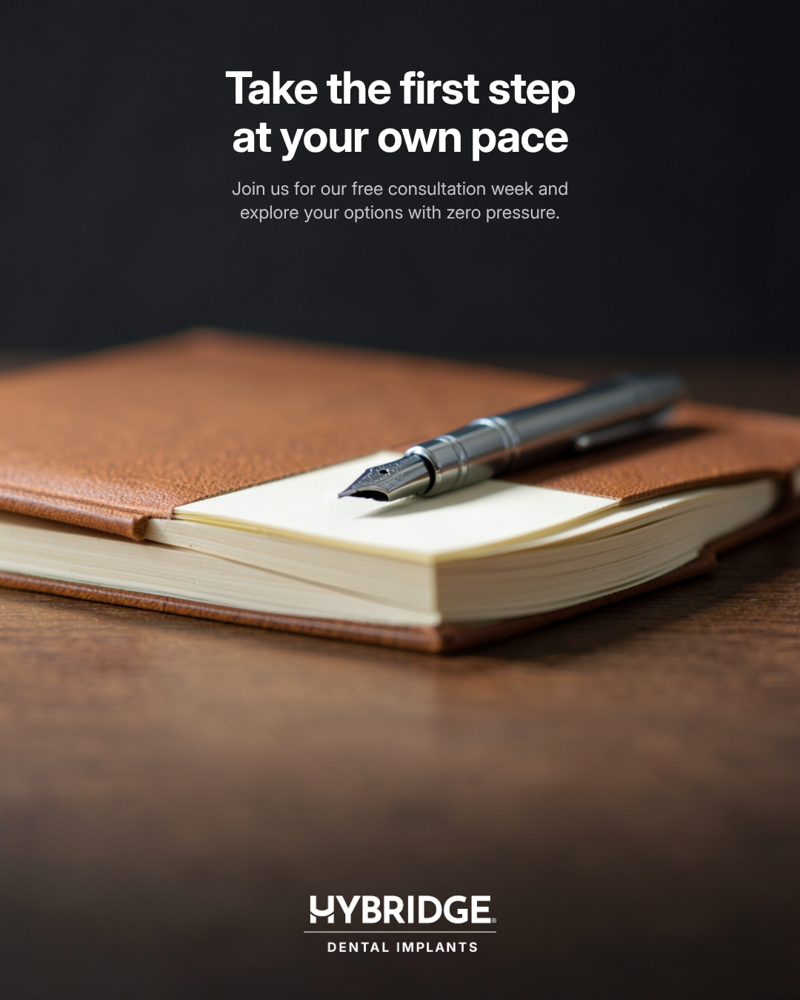
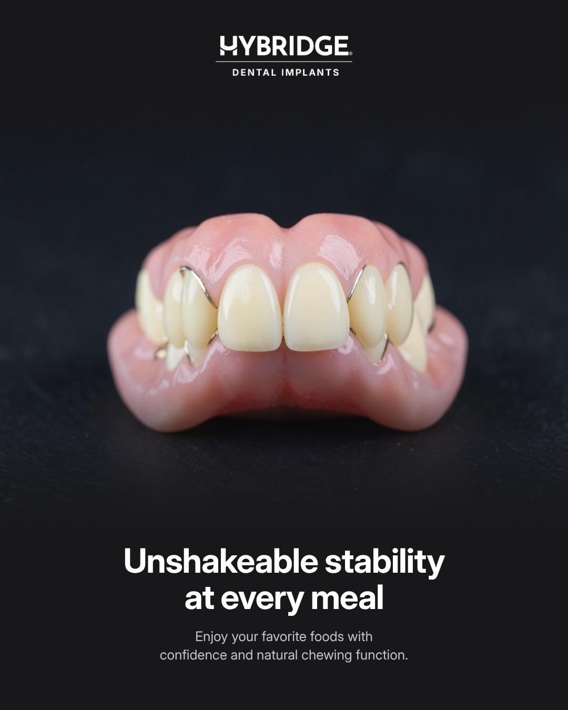
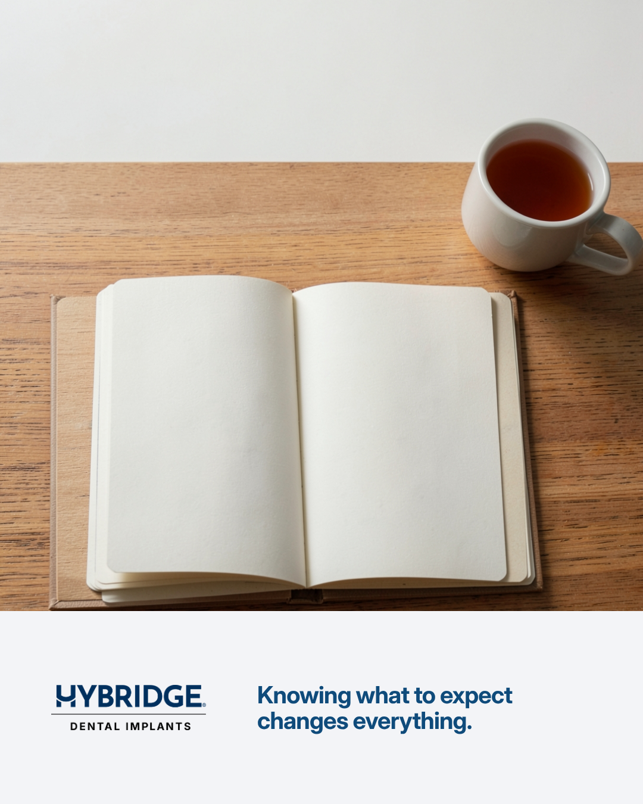
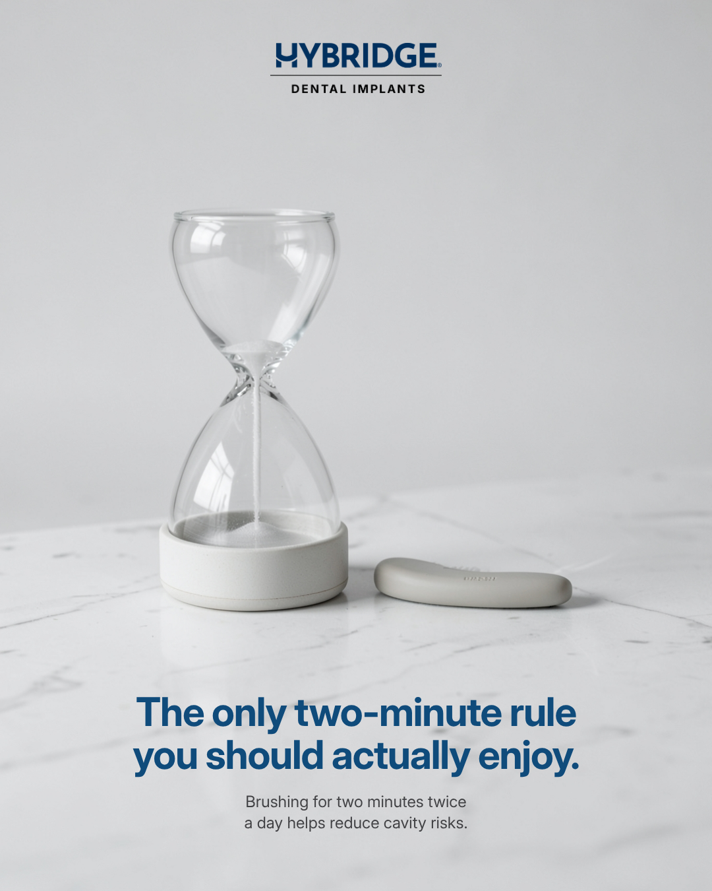
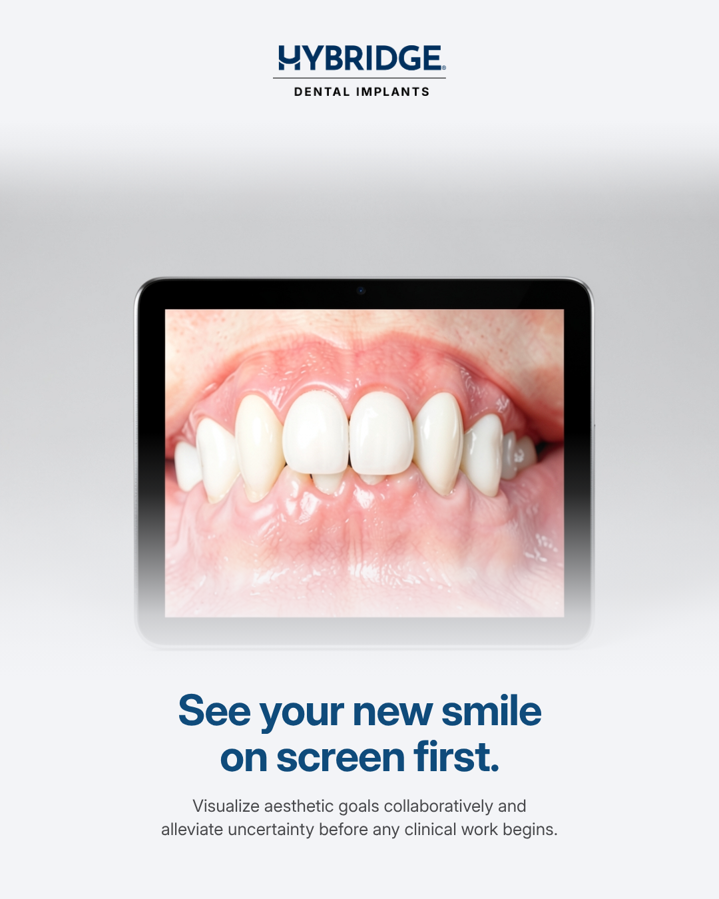
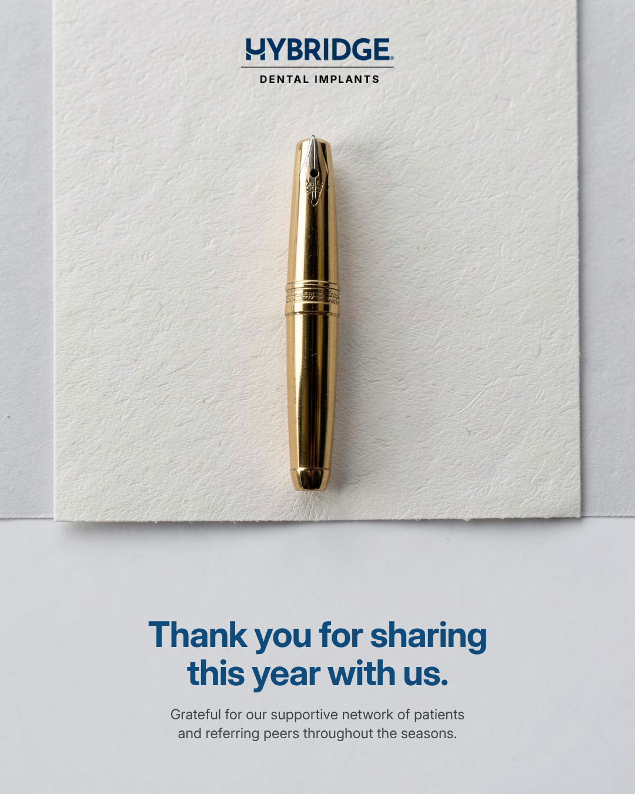

# Sample posts

Made on 2026-10-07 by scripts/make_samples.py through auto mode: 2 photos a round, up to 2 rounds and 4 photos, stop score 4.2.

| # | Brief | Headline | Layout | Rounds / photos | Critic (on brief · brand · craft · overall) | Final check | Contrast | Post |
| --- | --- | --- | --- | --- | --- | --- | --- | --- |
| 1 | Announce our free implant consultation week for new patients; calm and reassuring, no pressure. | Take the first step at your own pace | Full bleed | 1 / 2 | 5 · 5 · 5 · 5.0 | 4 of 5, ship | 15.3 | [01-announce-our-free-implant-consultation-week.png](01-announce-our-free-implant-consultation-week.png) |
| 2 | Explain in one line why a fixed full-arch implant bridge beats a removable denture for everyday eating. | Unshakeable stability at every meal | Hero | 2 / 4 | 3 · 3 · 3 · 3.0 | 5 of 5, ship | n/a | [02-explain-in-one-line-why-a.png](02-explain-in-one-line-why-a.png) |
| 3 | A post for people nervous about dental surgery: what to expect on the day, warm and honest. | Knowing what to expect changes everything. | Caption strip | 1 / 2 | 5 · 5 · 5 · 5.0 | 4 of 5, ship | 8.2 | [03-a-post-for-people-nervous-about.png](03-a-post-for-people-nervous-about.png) |
| 4 | Celebrate dental awareness week with a witty but professional note about looking after your teeth. | The only two-minute rule you should actually enjoy. | Full bleed | 1 / 2 | 5 · 5 · 5 · 5.0 | 4 of 5, ship | 6.3 | [04-celebrate-dental-awareness-week-with-a.png](04-celebrate-dental-awareness-week-with-a.png) |
| 5 | Introduce our digital smile preview: see your new smile on screen before treatment starts. | See your new smile on screen first. | Hero | 2 / 4 | 3 · 2 · 3 · 2.7 (wrong materials) | 4 of 5, ship | n/a | [05-introduce-our-digital-smile-preview-see.png](05-introduce-our-digital-smile-preview-see.png) |
| 6 | A quiet thank-you to our patients and the dentists who refer them, at the end of the year. | Thank you for sharing this year with us. | Full bleed | 1 / 2 | 5 · 5 · 5 · 5.0 | 4 of 5, ship | 6.1 | [06-a-quiet-thank-you-to-our.png](06-a-quiet-thank-you-to-our.png) |

## 1. Announce our free implant consultation week for new patients; calm and reassuring, no pressure.

We know that considering dental implants brings many questions, and our free consultation week is designed to give you clear, reassuring answers. Take all the time you need to explore your options in a calm and supportive environment. Book your private session with our team today.

#DentalImplants #SmileDesign #ImplantDentistry #PatientCare #DentalConsultation

### How it was made

Made automatically: 1 round, 2 photos, final check 4 of 5.

- Research: 10 sources, 3 directions; chose 1 "Quiet preparation for calm decisions". Direction 1 offers a gentle, generated photographic detail that avoids clinic specifics while directly addressing patient apprehension with a calm tone.
- Round 1: top 5.0 of 5, good enough, composing.
- Final check: picked Full bleed, words top centre, logo bottom centre (4 of 5). Biggest flaw: 

Trace: [http://localhost:8000/runs/07e0c5140114](http://localhost:8000/runs/07e0c5140114)

## 2. Explain in one line why a fixed full-arch implant bridge beats a removable denture for everyday eating.

Unlike removable dentures that can slip or shift, fixed solutions provide incredible stability and restore nearly all natural chewing function. Taste the difference of a secure, permanent smile every single day.

#DentalImplants #FullArch #FixedBridge #SmileRestoration #Hybridge

### How it was made

Made automatically: 2 rounds, 4 photos, final check 5 of 5.

- Research: 10 sources, 3 directions; chose 1 "Unshakeable stability at every meal". Direction 1 uses a premium hero object to clearly convey the stability of a fixed full-arch bridge in line with the brand feel.
- Round 1: top 3.0 under 4.2, revising: Use soft, deliberate studio lighting to create elegant highlights and subtle shadows on the bridge; Keep the photograph free of text, lettering and logos; the studio adds the words.
- Round 2: top 3.0 of 5, rounds limit reached, composing.
- Final check: picked Hero (5 of 5). Biggest flaw: The bottom subline text sits close to the lower edge, requiring precise alignment.

Trace: [http://localhost:8000/runs/7a9f3a10eef0](http://localhost:8000/runs/7a9f3a10eef0)

## 3. A post for people nervous about dental surgery: what to expect on the day, warm and honest.

It is completely normal to feel nervous before surgery day. By walking through each straightforward step ahead of time, we replace uncertainty with peace of mind. You are in safe, experienced hands every step of the way.

#DentalImplants #DentalSurgery #Hybridge #SmileRestoration #DentalCare

### How it was made

Made automatically: 1 round, 2 photos, final check 4 of 5.

- Research: 10 sources, 3 directions; chose 1 "Clear steps for surgery day". Direction 1 uses a generated object photograph that aligns with the brand's sleek and restrained feel while clearly communicating predictable steps for nervous patients.
- Round 1: top 5.0 of 5, good enough, composing.
- Final check: picked Caption strip, logo left (4 of 5). Biggest flaw: The bottom caption strip layout feels a bit unconventional and creates uneven negative space compared to the top logo placement.

Trace: [http://localhost:8000/runs/c63fd1babedf](http://localhost:8000/runs/c63fd1babedf)

## 4. Celebrate dental awareness week with a witty but professional note about looking after your teeth.

Good habits are the foundation of a great smile. Take two minutes today to give your teeth the care they deserve.

#DentalAwareness #OralHealth #Hybridge #HealthySmile #DentalCare

### How it was made

Made automatically: 1 round, 2 photos, final check 4 of 5.

- Research: 10 sources, 3 directions; chose 1 "Two minutes of your time". Direction 1 hits the brief with a generated photo that matches the brand feel through restrained design, a sleek object, and plenty of negative space.
- Round 1: top 5.0 of 5, good enough, composing.
- Final check: picked Full bleed, words bottom centre, logo top centre (4 of 5). Biggest flaw: The text placement slightly obscures the top portion of the hourglass in the hero layout.

Trace: [http://localhost:8000/runs/ff1aa981fc0a](http://localhost:8000/runs/ff1aa981fc0a)

## 5. Introduce our digital smile preview: see your new smile on screen before treatment starts.

Digital smile design software utilizes advanced scanning and planning inputs to map aesthetic outcomes digitally. Virtual planning helps bridge the communication gap between patients and practitioners so you can feel completely at ease.

#SmileDesign #DentalImplants #DigitalDentistry #Hybridge #SmilePreview

### How it was made

Made automatically: 2 rounds, 4 photos, final check 4 of 5.

- Research: 10 sources, 3 directions; chose 1 "Visualize your future smile". Direction 1 uses a generated photograph of a single appealing object with generous negative space, matching Hybridge's premium and restrained feel while introducing the digital smile preview clearly.
- Round 1: top 4.0 under 4.2, revising: Refine the 3D tooth rendering on the tablet screen to look more natural and anatomically accurate; Ensure the digital graphics on the screen maintain a crisp and professional aesthetic suitable for a premium dental brand.
- Round 2: top 2.7 of 5, rounds limit reached, composing.
- Final check: picked Hero (4 of 5). Biggest flaw: The vertical composition leaves slightly less negative space around the headline than the quality bar example.

Trace: [http://localhost:8000/runs/25df6497cda7](http://localhost:8000/runs/25df6497cda7)

## 6. A quiet thank-you to our patients and the dentists who refer them, at the end of the year.

As the calendar year draws to a close, we want to express our sincere appreciation to everyone who has trusted us and partnered with us. Seasonal messaging at the end of the calendar year helps maintain connections with communities, centered around our supportive network of patients and referring peers.

#Hybridge #DentalImplants #YearInReview #ThankYou #DentalCare

### How it was made

Made automatically: 1 round, 2 photos, final check 4 of 5.

- Research: 10 sources, 3 directions; chose 1 "Simple seasonal note of gratitude". Direction 1 fits the brand's requirement for a single strong image with plenty of space while warmly delivering the brief's thank-you message.
- Round 1: top 5.0 of 5, good enough, composing.
- Final check: picked Full bleed, words bottom centre, logo top centre (4 of 5). Biggest flaw: 

Trace: [http://localhost:8000/runs/8d6213a1ef96](http://localhost:8000/runs/8d6213a1ef96)
